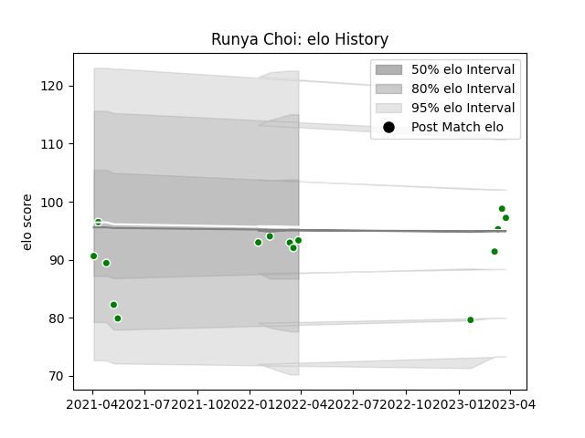

---  
layout: page  
title: Runya Choi  
date: 2023-03-29 11:28:24.577423  
categories: player  
---
# Runya Choi

Last updated: 2023-03-29
## Positions: P

## Current elo: 93.0

## Current Percentile: 12.0

# Elo History

# Match History

| Team            |   Appearances |   Win Rate |
|:----------------|--------------:|-----------:|
| Toyota Verblitz |            15 |   0.533333 |

| Opponent                          |   Matches |   Win Rate |
|:----------------------------------|----------:|-----------:|
| Saitama Wild Knights              |         3 |        0   |
| Tokyo Sungoliath                  |         2 |        0.5 |
| Toshiba Brave Lupus Tokyo         |         2 |        0   |
| Black Rams Tokyo                  |         1 |        1   |
| Green Rockets Tokatsu             |         1 |        1   |
| Hanazono Kintetsu Liners          |         1 |        1   |
| Hino Red Dolphins                 |         1 |        1   |
| Kubota Spears Funabashi Tokyo-Bay |         1 |        1   |
| Mitsubishi Dynaboars              |         1 |        1   |
| NTT Docomo Red Hurricanes Osaka   |         1 |        1   |
| Yokohama Canon Eagles             |         1 |        0   |