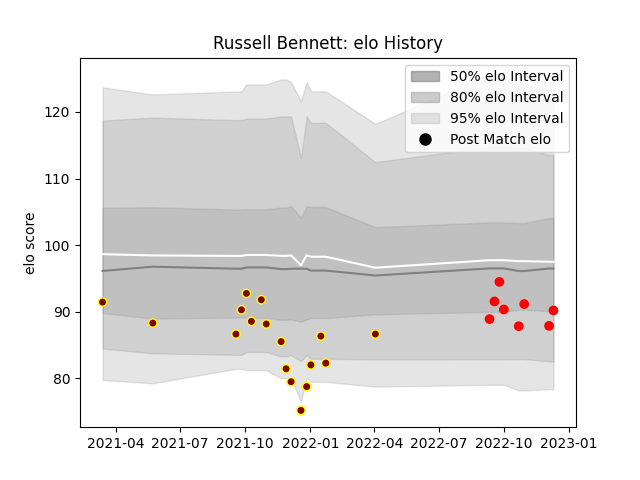

---  
layout: page  
title: Russell Bennett  
date: 2023-01-21 15:44:21.189556  
categories: player  
---
# Russell Bennett

## Positions: FH

## Current elo: 98.0

## Current Percentile: 13.0

# Elo History

# Match History

| Team     |   Appearances |   Win Rate |
|:---------|--------------:|-----------:|
| Ampthill |            26 |   0.423077 |
| Jersey   |            11 |   0.863636 |

| Opponent            |   Matches |   Win Rate |
|:--------------------|----------:|-----------:|
| Coventry            |         5 |   0.5      |
| Bedford             |         4 |   0.5      |
| Cornish Pirates     |         4 |   0.625    |
| Ealing Trailfinders |         4 |   0        |
| Nottingham          |         4 |   0.75     |
| Doncaster           |         3 |   0.333333 |
| Hartpury College    |         3 |   0.666667 |
| London Scottish     |         3 |   1        |
| Richmond            |         3 |   1        |
| Jersey              |         2 |   0.25     |
| Ampthill            |         1 |   1        |
| Saracens            |         1 |   0        |