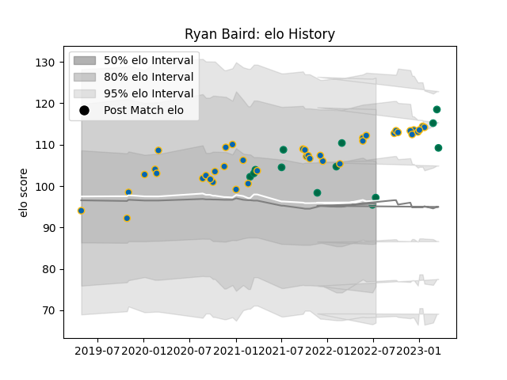

---  
layout: page  
title: Ryan Baird  
date: 2022-12-09 13:09:29.929957  
categories: player  
---
# Ryan Baird

## Positions: L, FL

## Country: Ireland

## Current elo: 107.0

## Current Percentile: 85.0

# Elo History

# Match History

| Team     |   Appearances |   Win Rate |
|:---------|--------------:|-----------:|
| Leinster |            31 |   0.903226 |
| Ireland  |             7 |   1        |

| Opponent                 |   Matches |   Win Rate |
|:-------------------------|----------:|-----------:|
| Dragons                  |         4 |   1        |
| Glasgow Warriors         |         4 |   1        |
| Ulster                   |         3 |   0.666667 |
| Connacht                 |         3 |   0.666667 |
| Munster                  |         3 |   1        |
| Benetton Treviso         |         2 |   1        |
| Italy                    |         2 |   1        |
| Scarlets                 |         2 |   1        |
| Ospreys                  |         2 |   1        |
| Zebre                    |         2 |   1        |
| Bulls                    |         1 |   1        |
| England                  |         1 |   1        |
| Edinburgh                |         1 |   1        |
| Saracens                 |         1 |   0        |
| Cheetahs                 |         1 |   1        |
| Scotland                 |         1 |   1        |
| Sharks                   |         1 |   1        |
| Cardiff Blues            |         1 |   1        |
| United States of America |         1 |   1        |
| Wales                    |         1 |   1        |
| Japan                    |         1 |   1        |