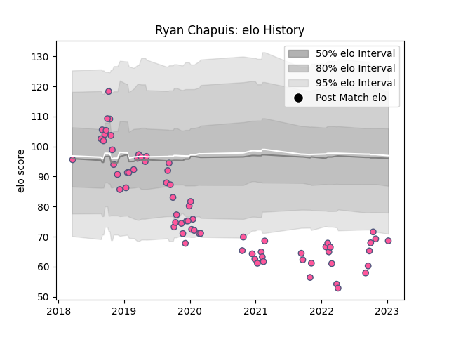

---  
layout: page  
title: Ryan Chapuis  
date: 2023-02-02 18:48:55.023262  
categories: player  
---
# Ryan Chapuis

## Positions: FL, N8

## Current elo: 57.0

## Current Percentile: 3.0

# Elo History

# Match History

| Team                 |   Appearances |   Win Rate |
|:---------------------|--------------:|-----------:|
| Stade Francais Paris |            73 |   0.335616 |

| Opponent            |   Matches |   Win Rate |
|:--------------------|----------:|-----------:|
| Bordeaux Begles     |         7 |   0.142857 |
| Pau                 |         7 |   0.571429 |
| Clermont Auvergne   |         6 |   0.166667 |
| Montpellier Herault |         6 |   0.25     |
| Toulon              |         5 |   0.4      |
| Racing 92           |         5 |   0.2      |
| Castres Olympique   |         5 |   0.8      |
| La Rochelle         |         4 |   0.25     |
| Lyon                |         4 |   0        |
| Stade Toulousain    |         3 |   0.666667 |
| Bayonne             |         3 |   0.666667 |
| Worcester Warriors  |         2 |   0        |
| Perpignan           |         2 |   0.5      |
| Zebre               |         2 |   0.5      |
| Brive               |         2 |   0        |
| Bristol Rugby       |         2 |   0        |
| Benetton Treviso    |         2 |   0        |
| Lions               |         1 |   1        |
| Ospreys             |         1 |   0        |
| Grenoble            |         1 |   0        |
| Connacht            |         1 |   1        |
| Biarritz Olympique  |         1 |   1        |
| Agen                |         1 |   0        |