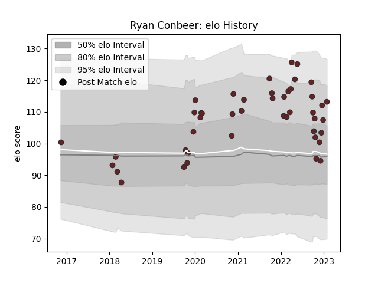

---  
layout: page  
title: Ryan Conbeer  
date: 2023-02-02 18:38:56.127842  
categories: player  
---
# Ryan Conbeer

## Positions: W

## Current elo: 113.0

## Current Percentile: 77.0

# Elo History

# Match History

| Team     |   Appearances |   Win Rate |
|:---------|--------------:|-----------:|
| Scarlets |            45 |   0.466667 |

| Opponent         |   Matches |   Win Rate |
|:-----------------|----------:|-----------:|
| Zebre            |         4 |   1        |
| Ospreys          |         4 |   0.375    |
| Ulster           |         4 |   0.25     |
| Connacht         |         4 |   0.5      |
| Edinburgh        |         4 |   0        |
| Leinster         |         4 |   0.125    |
| Benetton Treviso |         3 |   0.666667 |
| Cardiff Blues    |         3 |   0.666667 |
| Bulls            |         2 |   0.5      |
| Cheetahs         |         2 |   1        |
| Bayonne          |         2 |   1        |
| Stormers         |         2 |   0        |
| Southern Kings   |         1 |   1        |
| Bath Rugby       |         1 |   1        |
| Munster          |         1 |   0        |
| Lions            |         1 |   0        |
| Harlequins       |         1 |   0        |
| Bristol Rugby    |         1 |   0        |
| Glasgow Warriors |         1 |   1        |