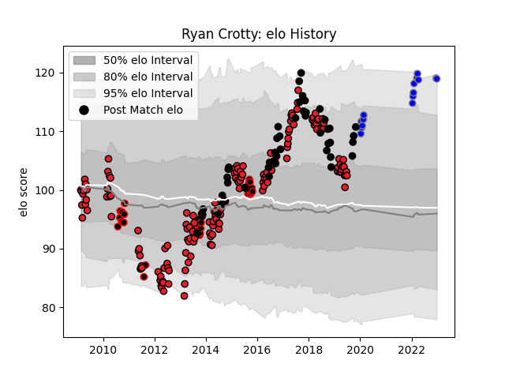

---  
layout: page  
title: Ryan Crotty  
date: 2023-01-13 11:28:01.245049  
categories: player  
---
# Ryan Crotty

## Positions: C

## Country: New Zealand

## Current elo: 105.0

## Current Percentile: 70.0

# Elo History

# Match History

| Team                              |   Appearances |   Win Rate |
|:----------------------------------|--------------:|-----------:|
| Crusaders                         |           153 |   0.74183  |
| New Zealand                       |            49 |   0.887755 |
| Canterbury                        |            34 |   0.838235 |
| Kubota Spears Funabashi Tokyo-Bay |            16 |   0.71875  |

| Opponent                        |   Matches |   Win Rate |
|:--------------------------------|----------:|-----------:|
| Blues                           |        17 |   0.882353 |
| Hurricanes                      |        17 |   0.5      |
| Highlanders                     |        15 |   0.8      |
| Chiefs                          |        15 |   0.6      |
| Australia                       |        11 |   0.863636 |
| Lions                           |        11 |   0.909091 |
| Stormers                        |         9 |   0.833333 |
| Bulls                           |         9 |   0.666667 |
| Sharks                          |         9 |   0.777778 |
| New South Wales Waratahs        |         9 |   0.666667 |
| Queensland Reds                 |         9 |   0.777778 |
| South Africa                    |         8 |   0.75     |
| Melbourne Rebels                |         7 |   0.714286 |
| Cheetahs                        |         7 |   0.714286 |
| Brumbies                        |         7 |   0.857143 |
| Western Force                   |         7 |   0.642857 |
| Wales                           |         6 |   1        |
| France                          |         5 |   1        |
| Auckland                        |         5 |   0.8      |
| England                         |         4 |   1        |
| Waikato                         |         4 |   0.75     |
| Wellington                      |         4 |   0.75     |
| Argentina                       |         4 |   1        |
| Tasman                          |         3 |   1        |
| Otago                           |         3 |   1        |
| North Harbour                   |         3 |   0.666667 |
| Yokohama Canon Eagles           |         3 |   0.5      |
| Ireland                         |         3 |   0.333333 |
| Taranaki                        |         2 |   0.5      |
| Hawke's Bay                     |         2 |   0.75     |
| Bay of Plenty                   |         2 |   1        |
| Manawatu                        |         2 |   1        |
| Counties Manukau                |         2 |   1        |
| Jaguares                        |         2 |   1        |
| Urayasu D-Rocks                 |         2 |   1        |
| Scotland                        |         2 |   1        |
| Southern Kings                  |         2 |   1        |
| Tonga                           |         1 |   1        |
| Toshiba Brave Lupus Tokyo       |         1 |   1        |
| Mie Honda Heat                  |         1 |   1        |
| Toyota Verblitz                 |         1 |   0        |
| Tokyo Sungoliath                |         1 |   1        |
| Canada                          |         1 |   1        |
| British and Irish Lions         |         1 |   1        |
| United States of America        |         1 |   1        |
| Hanazono Kintetsu Liners        |         1 |   1        |
| Green Rockets Tokatsu           |         1 |   1        |
| Sunwolves                       |         1 |   1        |
| Southland                       |         1 |   1        |
| Hino Red Dolphins               |         1 |   1        |
| Samoa                           |         1 |   1        |
| Saitama Wild Knights            |         1 |   0        |
| Northland                       |         1 |   1        |
| Japan                           |         1 |   1        |
| Kobelco Kobe Steelers           |         1 |   0        |
| NTT Docomo Red Hurricanes Osaka |         1 |   1        |
| Munakata Sanix Blues            |         1 |   1        |