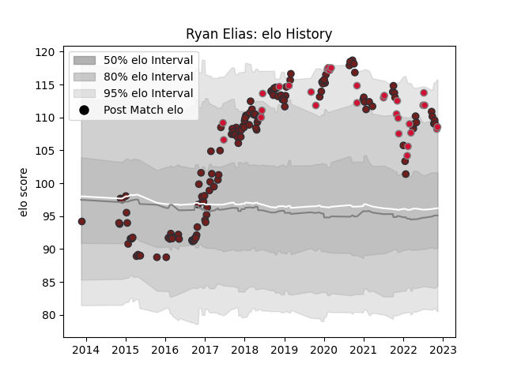

---  
layout: page  
title: Ryan Elias  
date: 2022-12-14 11:34:09.408153  
categories: player  
---
# Ryan Elias

## Positions: H

## Country: Wales

## Current elo: 110.0

## Current Percentile: 89.0

# Elo History

# Match History

| Team     |   Appearances |   Win Rate |
|:---------|--------------:|-----------:|
| Scarlets |           139 |    0.57554 |
| Wales    |            31 |    0.5     |

| Opponent           |   Matches |   Win Rate |
|:-------------------|----------:|-----------:|
| Cardiff Blues      |        14 |   0.642857 |
| Ospreys            |        12 |   0.708333 |
| Leinster           |        11 |   0.5      |
| Ulster             |        10 |   0.3      |
| Dragons            |        10 |   0.9      |
| Munster            |         9 |   0.388889 |
| Connacht           |         9 |   0.555556 |
| Toulon             |         8 |   0.25     |
| Benetton Treviso   |         8 |   0.875    |
| Edinburgh          |         8 |   0.375    |
| Glasgow Warriors   |         7 |   0.571429 |
| Zebre              |         6 |   1        |
| South Africa       |         5 |   0.4      |
| Argentina          |         4 |   0.875    |
| Leicester Tigers   |         3 |   0.333333 |
| Cheetahs           |         3 |   0.666667 |
| France             |         3 |   0        |
| Southern Kings     |         3 |   1        |
| Bayonne            |         3 |   1        |
| Ireland            |         3 |   0        |
| Saracens           |         3 |   0.166667 |
| Australia          |         2 |   0.5      |
| Italy              |         2 |   1        |
| Bath Rugby         |         2 |   0.5      |
| Scotland           |         2 |   0.5      |
| Tonga              |         2 |   1        |
| New Zealand        |         2 |   0        |
| England            |         2 |   0        |
| Racing 92          |         2 |   0        |
| Sale Sharks        |         2 |   0.5      |
| Uruguay            |         1 |   1        |
| Bordeaux Begles    |         1 |   0        |
| Fiji               |         1 |   1        |
| Samoa              |         1 |   1        |
| Northampton Saints |         1 |   0        |
| Canada             |         1 |   1        |
| London Irish       |         1 |   1        |
| Lions              |         1 |   1        |
| La Rochelle        |         1 |   1        |
| Bristol Rugby      |         1 |   0        |