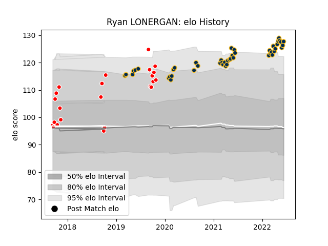

---  
layout: page  
title: Ryan LONERGAN  
date: 2023-03-12 11:32:18.532079  
categories: player  
---
# Ryan LONERGAN

## Positions: SH

## Current elo: 128.0

## Current Percentile: 95.0

# Elo History

# Match History

| Team             |   Appearances |   Win Rate |
|:-----------------|--------------:|-----------:|
| Brumbies         |            46 |   0.652174 |
| Canberra Vikings |            24 |   0.708333 |

| Opponent                 |   Matches |   Win Rate |
|:-------------------------|----------:|-----------:|
| Western Force            |         8 |   0.75     |
| Queensland Reds          |         8 |   0.375    |
| Fijian Drua              |         6 |   0.833333 |
| New South Wales Waratahs |         6 |   1        |
| Melbourne Rebels         |         6 |   0.666667 |
| Blues                    |         4 |   0.25     |
| Highlanders              |         3 |   0.333333 |
| Hurricanes               |         3 |   1        |
| Brisbane City            |         3 |   0.666667 |
| NSW Country Eagles       |         3 |   0.666667 |
| Chiefs                   |         3 |   0.666667 |
| Sydney Rays              |         3 |   1        |
| Melbourne Rising         |         3 |   1        |
| Crusaders                |         2 |   0        |
| Perth Spirit             |         2 |   1        |
| Queensland Country       |         2 |   0        |
| Sunwolves                |         2 |   1        |
| Greater Sydney Rams      |         1 |   1        |
| Moana Pasifika           |         1 |   0        |
| Bulls                    |         1 |   1        |