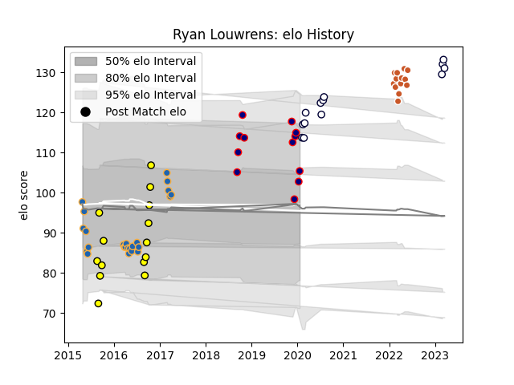

---  
layout: page  
title: Ryan Louwrens  
date: 2023-03-21 17:57:58.265296  
categories: player  
---
# Ryan Louwrens

Last updated: 2023-03-21
## Positions: SH

## Current elo: 105.0

## Current Percentile: 87.0

# Elo History

# Match History

| Team                     |   Appearances |   Win Rate |
|:-------------------------|--------------:|-----------:|
| Western Force            |            24 |   0.166667 |
| Perth Spirit             |            14 |   0.642857 |
| Austin Gilgronis         |            13 |   0.692308 |
| Melbourne Rebels         |            13 |   0.5      |
| Hanazono Kintetsu Liners |            12 |   1        |

| Opponent                         |   Matches |   Win Rate |
|:---------------------------------|----------:|-----------:|
| New South Wales Waratahs         |         6 |   0.666667 |
| Brumbies                         |         5 |   0        |
| Blues                            |         3 |   0        |
| Chiefs                           |         3 |   0        |
| Queensland Reds                  |         3 |   0.5      |
| North Harbour Rays               |         3 |   0.333333 |
| Highlanders                      |         3 |   0.333333 |
| Kyuden Voltex                    |         2 |   1        |
| Utah Warriors                    |         2 |   0.5      |
| Seattle Seawolves                |         2 |   1        |
| San Diego Legion                 |         2 |   1        |
| Brisbane City                    |         2 |   0.5      |
| Melbourne Rebels                 |         2 |   0.5      |
| Mazda Blue Zoomers               |         2 |   1        |
| L. A. Giltinis                   |         2 |   0.5      |
| Melbourne Rising                 |         2 |   1        |
| Kurita Water Gush                |         2 |   1        |
| Greater Sydney Rams              |         2 |   1        |
| Canberra Vikings                 |         2 |   0.5      |
| Crusaders                        |         2 |   0        |
| Western Force                    |         2 |   0.5      |
| Hurricanes                       |         2 |   0        |
| Houston SaberCats                |         1 |   1        |
| Cheetahs                         |         1 |   0        |
| Bulls                            |         1 |   0        |
| Toyota Industries Shuttles Aichi |         1 |   1        |
| Sydney Stars                     |         1 |   0        |
| Sunwolves                        |         1 |   1        |
| Stormers                         |         1 |   0        |
| Shimizu Blue Sharks              |         1 |   1        |
| Sharks                           |         1 |   0        |
| Lions                            |         1 |   1        |
| Rugby ATL                        |         1 |   0        |
| Mitsubishi Dynaboars             |         1 |   1        |
| Coca-Cola Red Sparks             |         1 |   1        |
| Kamaishi Seawaves                |         1 |   1        |
| Old Glory DC                     |         1 |   1        |
| Dallas Jackals                   |         1 |   1        |
| New England Free Jacks           |         1 |   0        |
| NTT Docomo Red Hurricanes Osaka  |         1 |   1        |
| NSW Country Eagles               |         1 |   1        |
| Queensland Country               |         1 |   1        |