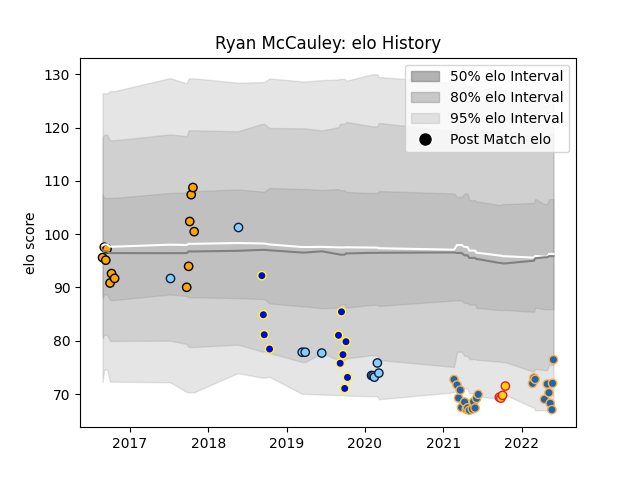

---  
layout: page  
title: Ryan McCauley  
date: 2023-03-21 18:36:49.567222  
categories: player  
---
# Ryan McCauley

Last updated: 2023-03-21
## Positions: L

## Current elo: 78.0

## Current Percentile: 9.0

# Elo History

# Match History

| Team                     |   Appearances |   Win Rate |
|:-------------------------|--------------:|-----------:|
| Western Force            |            26 |  0.307692  |
| NSW Country Eagles       |            13 |  0.730769  |
| Sydney Rays              |            11 |  0.0909091 |
| New South Wales Waratahs |            10 |  0.2       |
| Exeter Chiefs            |             4 |  0.5       |

| Opponent                 |   Matches |   Win Rate |
|:-------------------------|----------:|-----------:|
| Brumbies                 |         5 |   0        |
| Highlanders              |         5 |   0.2      |
| Melbourne Rising         |         4 |   0.5      |
| Melbourne Rebels         |         4 |   0.5      |
| Canberra Vikings         |         4 |   0.5      |
| Brisbane City            |         4 |   0.375    |
| Queensland Reds          |         3 |   0.333333 |
| Queensland Country       |         3 |   0.333333 |
| New South Wales Waratahs |         3 |   0.666667 |
| Blues                    |         3 |   0        |
| Crusaders                |         3 |   0        |
| Chiefs                   |         3 |   0        |
| Hurricanes               |         2 |   0.5      |
| Moana Pasifika           |         2 |   1        |
| NSW Country Eagles       |         2 |   0        |
| Perth Spirit             |         2 |   0.5      |
| Jaguares                 |         1 |   0        |
| Wasps                    |         1 |   1        |
| Sydney Rays              |         1 |   1        |
| Sunwolves                |         1 |   0        |
| Sale Sharks              |         1 |   1        |
| Northampton Saints       |         1 |   0        |
| Leicester Tigers         |         1 |   0        |
| North Harbour Rays       |         1 |   1        |
| Fijian Drua              |         1 |   0        |
| Greater Sydney Rams      |         1 |   1        |
| Lions                    |         1 |   1        |
| Western Force            |         1 |   0        |