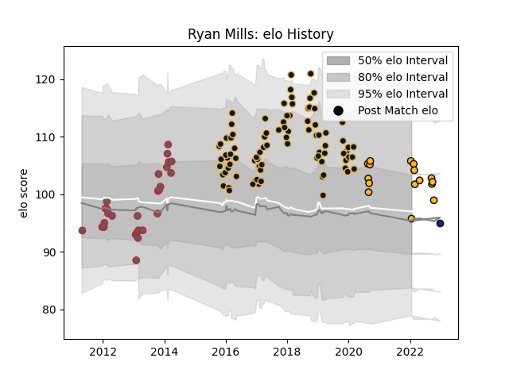

---  
layout: page  
title: Ryan Mills  
date: 2023-02-02 19:13:36.070289  
categories: player  
---
# Ryan Mills

## Positions: C, FH

## Current elo: 97.0

## Current Percentile: None

# Elo History

# Match History

| Team               |   Appearances |   Win Rate |
|:-------------------|--------------:|-----------:|
| Worcester Warriors |            88 |   0.380682 |
| Gloucester Rugby   |            30 |   0.516667 |
| Wasps              |            16 |   0.625    |
| Sale Sharks        |             2 |   0.5      |

| Opponent             |   Matches |   Win Rate |
|:---------------------|----------:|-----------:|
| Bath Rugby           |        15 |   0.466667 |
| Northampton Saints   |        13 |   0.384615 |
| Leicester Tigers     |        13 |   0.461538 |
| Harlequins           |        11 |   0.454545 |
| Wasps                |         9 |   0.222222 |
| Sale Sharks          |         9 |   0.222222 |
| Saracens             |         8 |   0.3125   |
| Exeter Chiefs        |         8 |   0.375    |
| Gloucester Rugby     |         8 |   0.25     |
| Newcastle Falcons    |         8 |   0.5      |
| Bristol Rugby        |         6 |   0.666667 |
| London Irish         |         5 |   0.6      |
| Worcester Warriors   |         4 |   0.75     |
| Dragons              |         3 |   0.666667 |
| Stade Toulousain     |         2 |   1        |
| Zebre                |         2 |   0        |
| La Rochelle          |         2 |   0.5      |
| Cardiff Blues        |         2 |   1        |
| Ospreys              |         1 |   1        |
| Pau                  |         1 |   1        |
| Perpignan            |         1 |   1        |
| Connacht             |         1 |   0.5      |
| Stade Francais Paris |         1 |   1        |
| Castres Olympique    |         1 |   0        |
| Brive                |         1 |   0        |
| Munster              |         1 |   0        |