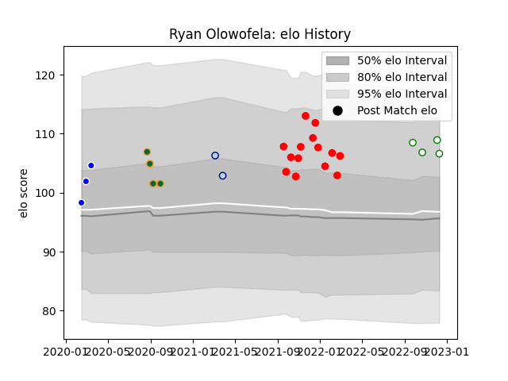

---  
layout: page  
title: Ryan Olowofela  
date: 2022-12-14 11:21:14.801254  
categories: player  
---
# Ryan Olowofela

## Positions: W

## Current elo: 107.0

## Current Percentile: 85.0

# Elo History

# Match History

| Team               |   Appearances |   Win Rate |
|:-------------------|--------------:|-----------:|
| Jersey             |            14 |   0.535714 |
| Northampton Saints |             4 |   0.25     |
| Nottingham         |             4 |   0.5      |
| Coventry           |             3 |   0.666667 |
| Bedford            |             2 |   0        |

| Opponent            |   Matches |   Win Rate |
|:--------------------|----------:|-----------:|
| Doncaster           |         3 |   0.333333 |
| Ealing Trailfinders |         3 |   0        |
| Bedford             |         3 |   0.333333 |
| Richmond            |         2 |   1        |
| Coventry            |         2 |   0.5      |
| London Scottish     |         2 |   1        |
| Jersey              |         2 |   0        |
| Ampthill            |         1 |   0.5      |
| London Irish        |         1 |   1        |
| Sale Sharks         |         1 |   0        |
| Nottingham          |         1 |   1        |
| Harlequins          |         1 |   0        |
| Hartpury College    |         1 |   1        |
| Cornish Pirates     |         1 |   0        |
| Caldy               |         1 |   1        |
| Bristol Rugby       |         1 |   0        |
| Yorkshire Carnegie  |         1 |   1        |