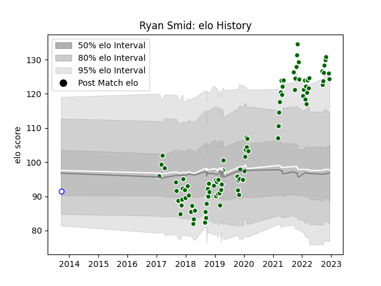

---  
layout: page  
title: Ryan Smid  
date: 2022-12-14 11:27:43.793098  
categories: player  
---
# Ryan Smid

## Positions: N8, FL

## Current elo: 124.0

## Current Percentile: 95.0

# Elo History

# Match History

| Team                |   Appearances |   Win Rate |
|:--------------------|--------------:|-----------:|
| Ealing Trailfinders |            92 |   0.809783 |
| Western Province    |             1 |   1        |

| Opponent           |   Matches |   Win Rate |
|:-------------------|----------:|-----------:|
| Nottingham         |        10 |   0.8      |
| Cornish Pirates    |         9 |   0.666667 |
| Doncaster          |         9 |   0.666667 |
| Hartpury College   |         9 |   1        |
| Bedford            |         9 |   0.777778 |
| Coventry           |         8 |   0.9375   |
| Jersey             |         7 |   1        |
| London Scottish    |         7 |   1        |
| Richmond           |         7 |   0.857143 |
| Yorkshire Carnegie |         5 |   0.8      |
| Ampthill           |         4 |   1        |
| Rotherham Titans   |         3 |   1        |
| Bristol Rugby      |         2 |   0        |
| London Irish       |         1 |   0        |
| Newcastle Falcons  |         1 |   0        |
| Griquas            |         1 |   1        |
| Saracens           |         1 |   0        |