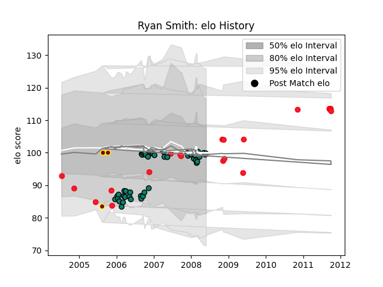

---  
layout: page  
title: Ryan Smith  
date: 2023-03-21 18:32:17.615685  
categories: player  
---
# Ryan Smith

Last updated: 2023-03-21
## Positions: C, FH

## Country: Canada

## Current elo: 100.0

## Current Percentile: 47.0

# Elo History

# Match History

| Team      |   Appearances |   Win Rate |
|:----------|--------------:|-----------:|
| Montauban |            47 |   0.542553 |
| Canada    |            22 |   0.204545 |
| Southland |             3 |   0        |

| Opponent             |   Matches |   Win Rate |
|:---------------------|----------:|-----------:|
| Wales                |         4 |   0        |
| Stade Toulousain     |         4 |   0        |
| Dax                  |         4 |   0.75     |
| France               |         3 |   0        |
| Bayonne              |         3 |   0.666667 |
| Perpignan            |         3 |   0.333333 |
| Brive                |         3 |   1        |
| Japan                |         3 |   0.5      |
| Castres Olympique    |         3 |   0.166667 |
| Albi                 |         3 |   0.5      |
| Stade Francais Paris |         2 |   1        |
| New Zealand          |         2 |   0        |
| Montpellier Herault  |         2 |   0.5      |
| La Rochelle          |         2 |   0.5      |
| Ireland              |         2 |   0        |
| Agen                 |         2 |   0.5      |
| Clermont Auvergne    |         2 |   0        |
| Bourgoin-Jallieu     |         2 |   0.5      |
| Auch                 |         2 |   0.5      |
| Biarritz Olympique   |         2 |   0.25     |
| Fiji                 |         1 |   0        |
| Provence Rugby       |         1 |   1        |
| Waikato              |         1 |   0        |
| Tonga                |         1 |   1        |
| Tarbes               |         1 |   1        |
| Belgium              |         1 |   1        |
| Scotland             |         1 |   0        |
| Romania              |         1 |   0        |
| Racing 92            |         1 |   1        |
| Beziers              |         1 |   1        |
| Portugal             |         1 |   1        |
| England              |         1 |   0        |
| North Harbour        |         1 |   0        |
| Bordeaux Begles      |         1 |   1        |
| Mont-de-Marsan       |         1 |   1        |
| Lyon                 |         1 |   0        |
| Canterbury           |         1 |   0        |
| Colomiers            |         1 |   1        |
| Italy                |         1 |   0        |