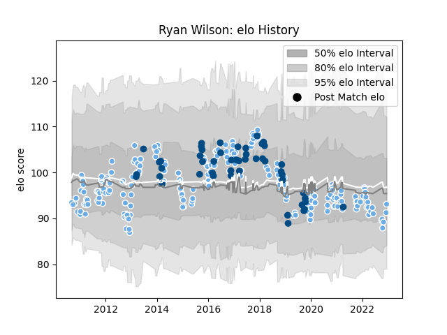

---  
layout: page  
title: Ryan Wilson  
date: 2022-12-14 11:27:49.732261  
categories: player  
---
# Ryan Wilson

## Positions: N8, FL

## Country: Scotland

## Current elo: 93.0

## Current Percentile: 30.0

# Elo History

# Match History

| Team             |   Appearances |   Win Rate |
|:-----------------|--------------:|-----------:|
| Glasgow Warriors |           209 |   0.547847 |
| Scotland         |            49 |   0.591837 |

| Opponent                 |   Matches |   Win Rate |
|:-------------------------|----------:|-----------:|
| Edinburgh                |        22 |   0.5      |
| Leinster                 |        17 |   0.205882 |
| Ulster                   |        16 |   0.4375   |
| Cardiff Blues            |        16 |   0.625    |
| Munster                  |        16 |   0.4375   |
| Benetton Treviso         |        14 |   0.785714 |
| Ospreys                  |        14 |   0.678571 |
| Scarlets                 |        13 |   0.384615 |
| Dragons                  |        12 |   0.75     |
| Zebre                    |        11 |   1        |
| Connacht                 |        11 |   0.590909 |
| France                   |         7 |   0.571429 |
| Italy                    |         7 |   1        |
| Ireland                  |         6 |   0.166667 |
| Wales                    |         5 |   0.2      |
| Montpellier Herault      |         5 |   0.5      |
| Japan                    |         4 |   0.75     |
| Northampton Saints       |         4 |   0.25     |
| Aironi                   |         4 |   1        |
| Exeter Chiefs            |         4 |   0.375    |
| England                  |         3 |   0.333333 |
| Australia                |         3 |   0.666667 |
| South Africa             |         3 |   0        |
| Bath Rugby               |         3 |   0.666667 |
| Saracens                 |         3 |   0        |
| Racing 92                |         3 |   0.666667 |
| Samoa                    |         3 |   1        |
| Fiji                     |         2 |   0.5      |
| Wasps                    |         2 |   0.5      |
| Stade Toulousain         |         2 |   0        |
| Sharks                   |         2 |   0.5      |
| Georgia                  |         2 |   1        |
| Bulls                    |         2 |   0.5      |
| Castres Olympique        |         2 |   0        |
| Argentina                |         2 |   1        |
| Leicester Tigers         |         2 |   1        |
| La Rochelle              |         2 |   0.5      |
| Sale Sharks              |         2 |   1        |
| Russia                   |         1 |   1        |
| Cheetahs                 |         1 |   1        |
| Lyon                     |         1 |   1        |
| Southern Kings           |         1 |   0        |
| Lions                    |         1 |   1        |
| Toulon                   |         1 |   0        |
| United States of America |         1 |   1        |