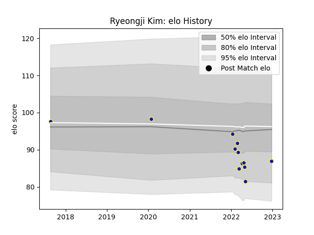

---  
layout: page  
title: Ryeongji Kim  
date: 2023-01-17 11:37:37.512155  
categories: player  
---
# Ryeongji Kim

## Positions: L

## Current elo: 76.0

## Current Percentile: 8.0

# Elo History

# Match History

| Team            |   Appearances |   Win Rate |
|:----------------|--------------:|-----------:|
| Urayasu D-Rocks |            13 |   0.307692 |

| Opponent                          |   Matches |   Win Rate |
|:----------------------------------|----------:|-----------:|
| Kubota Spears Funabashi Tokyo-Bay |         3 |          0 |
| Saitama Wild Knights              |         2 |          0 |
| Black Rams Tokyo                  |         1 |          0 |
| Green Rockets Tokatsu             |         1 |          1 |
| Kobelco Kobe Steelers             |         1 |          0 |
| Shimizu Blue Sharks               |         1 |          1 |
| Shizuoka Blue Revs                |         1 |          0 |
| Toshiba Brave Lupus Tokyo         |         1 |          1 |
| Toyota Industries Shuttles Aichi  |         1 |          1 |
| Toyota Verblitz                   |         1 |          0 |