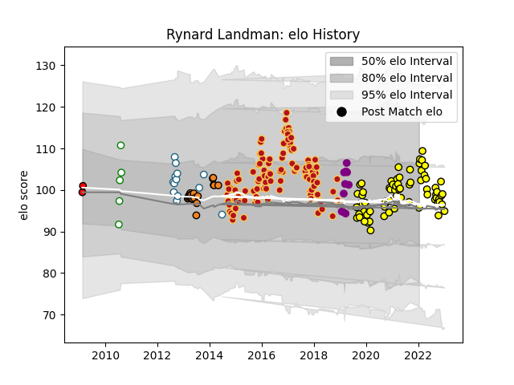

---  
layout: page  
title: Rynard Landman  
date: 2022-12-18 16:26:19.370990  
categories: player  
---
# Rynard Landman

## Positions: L

## Current elo: 97.0

## Current Percentile: 48.0

# Elo History

# Match History

| Team             |   Appearances |   Win Rate |
|:-----------------|--------------:|-----------:|
| Dragons          |           113 |   0.318584 |
| Carcassonne      |            59 |   0.491525 |
| Cheetahs         |            21 |   0.52381  |
| Griquas          |            12 |   0.416667 |
| Soyaux-Angouleme |             8 |   0.625    |
| Leopards         |             5 |   0        |
| Lions            |             2 |   0.5      |

| Opponent                   |   Matches |   Win Rate |
|:---------------------------|----------:|-----------:|
| Ospreys                    |         9 |  0.111111  |
| Edinburgh                  |         8 |  0.25      |
| Glasgow Warriors           |         8 |  0.0625    |
| Scarlets                   |         8 |  0.25      |
| Leinster                   |         8 |  0.25      |
| Munster                    |         7 |  0.142857  |
| Benetton Treviso           |         7 |  0.428571  |
| Cardiff Blues              |         7 |  0.142857  |
| Connacht                   |         7 |  0.285714  |
| Mont-de-Marsan             |         6 |  0.333333  |
| Zebre                      |         6 |  0.666667  |
| Ulster                     |         6 |  0.0833333 |
| Aurillac                   |         5 |  0.6       |
| Nevers                     |         5 |  0.6       |
| Oyonnax                    |         5 |  0         |
| Provence Rugby             |         5 |  0.6       |
| Newcastle Falcons          |         5 |  0.2       |
| Montauban                  |         5 |  0.8       |
| Colomiers                  |         4 |  0.25      |
| Vannes                     |         4 |  0.375     |
| Biarritz Olympique         |         4 |  0.5       |
| Beziers                    |         4 |  1         |
| Natal Sharks               |         4 |  0.5       |
| Rouen                      |         4 |  0.75      |
| Bulls                      |         4 |  0.25      |
| RC Enisei                  |         4 |  0.75      |
| Golden Lions               |         4 |  0.5       |
| Western Province           |         3 |  0         |
| Grenoble                   |         3 |  0.333333  |
| Worcester Warriors         |         3 |  0.666667  |
| Perpignan                  |         3 |  0         |
| Blue Bulls                 |         3 |  0.333333  |
| Southern Kings             |         3 |  0.666667  |
| Sharks                     |         2 |  0.5       |
| Queensland Reds            |         2 |  0.5       |
| Sale Sharks                |         2 |  0.5       |
| Pau                        |         2 |  1         |
| Free State Cheetahs        |         2 |  0         |
| Bordeaux Begles            |         2 |  0.5       |
| Castres Olympique          |         2 |  0.5       |
| Brive                      |         2 |  0.5       |
| Soyaux-Angouleme           |         2 |  0.25      |
| Stade Francais Paris       |         2 |  1         |
| Gloucester Rugby           |         2 |  0.5       |
| Melbourne Rebels           |         2 |  0.5       |
| Bayonne                    |         2 |  1         |
| Stormers                   |         2 |  0.5       |
| Western Force              |         1 |  1         |
| Saracens                   |         1 |  0         |
| US Bressane                |         1 |  1         |
| Valence Romans Drome Rugby |         1 |  0         |
| Blues                      |         1 |  1         |
| Pumas                      |         1 |  0         |
| Chiefs                     |         1 |  0         |
| Northampton Saints         |         1 |  0         |
| New South Wales Waratahs   |         1 |  1         |
| Narbonne                   |         1 |  1         |
| Brumbies                   |         1 |  0         |
| Montpellier Herault        |         1 |  0         |
| Bucuresti                  |         1 |  1         |
| Massy                      |         1 |  0         |
| London Welsh               |         1 |  1         |
| Lions                      |         1 |  0         |
| Carcassonne                |         1 |  1         |
| Hurricanes                 |         1 |  0         |
| Highlanders                |         1 |  1         |
| Cheetahs                   |         1 |  1         |
| Agen                       |         1 |  1         |