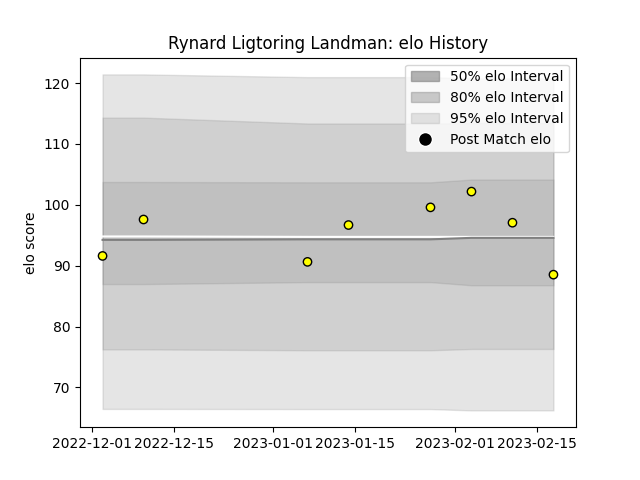

---  
layout: page  
title: Rynard Ligtoring Landman  
date: 2023-02-24 02:32:17.862768  
categories: player  
---
# Rynard Ligtoring Landman

## Positions: L

## Current elo: 89.0

## Current Percentile: 57.0

# Elo History

# Match History

| Team        |   Appearances |   Win Rate |
|:------------|--------------:|-----------:|
| Carcassonne |             8 |     0.3125 |

| Opponent         |   Matches |   Win Rate |
|:-----------------|----------:|-----------:|
| Aurillac         |         1 |        0   |
| Colomiers        |         1 |        0   |
| Grenoble         |         1 |        0.5 |
| Massy            |         1 |        0   |
| Nevers           |         1 |        1   |
| Provence Rugby   |         1 |        0   |
| Rouen            |         1 |        1   |
| Soyaux-Angouleme |         1 |        0   |