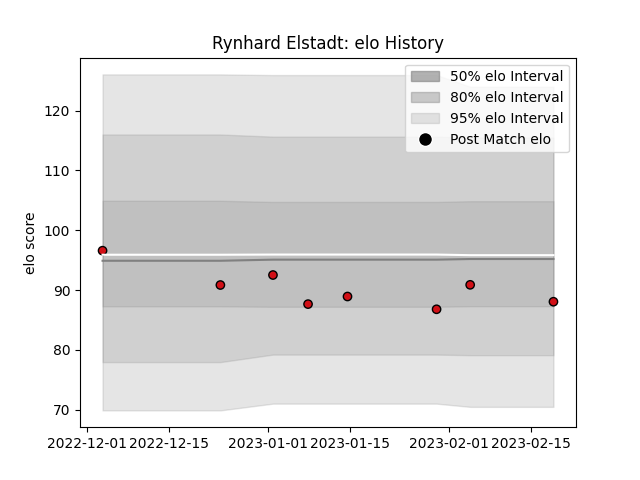

---  
layout: page  
title: Rynhard Elstadt  
date: 2023-02-24 02:21:00.580796  
categories: player  
---
# Rynhard Elstadt

## Positions: FL

## Current elo: 88.0

## Current Percentile: 37.0

# Elo History

# Match History

| Team             |   Appearances |   Win Rate |
|:-----------------|--------------:|-----------:|
| Stade Toulousain |             8 |       0.75 |

| Opponent            |   Matches |   Win Rate |
|:--------------------|----------:|-----------:|
| Bayonne             |         1 |          1 |
| Castres Olympique   |         1 |          1 |
| Clermont Auvergne   |         1 |          1 |
| La Rochelle         |         1 |          0 |
| Montpellier Herault |         1 |          1 |
| Perpignan           |         1 |          1 |
| Sale Sharks         |         1 |          1 |
| Toulon              |         1 |          0 |