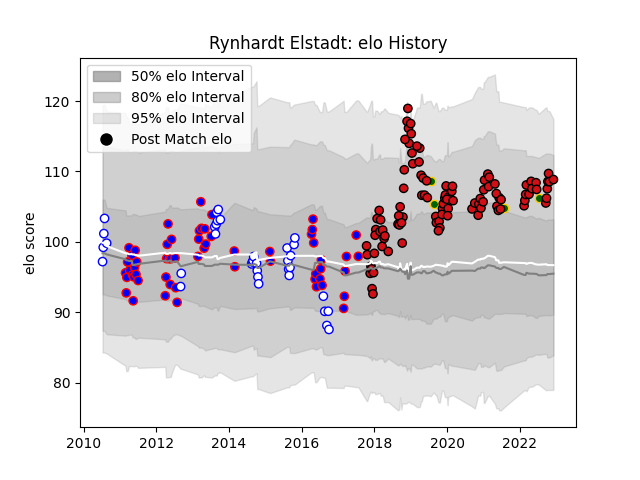

---  
layout: page  
title: Rynhardt Elstadt  
date: 2023-02-02 18:59:16.062594  
categories: player  
---
# Rynhardt Elstadt

## Positions: FL, L

## Country: South Africa

## Current elo: 108.0

## Current Percentile: 77.0

# Elo History

# Match History

| Team             |   Appearances |   Win Rate |
|:-----------------|--------------:|-----------:|
| Stade Toulousain |           105 |   0.695238 |
| Stormers         |            58 |   0.663793 |
| Western Province |            35 |   0.742857 |
| South Africa     |             4 |   0.5      |

| Opponent                 |   Matches |   Win Rate |
|:-------------------------|----------:|-----------:|
| La Rochelle              |        10 |   0.8      |
| Castres Olympique        |         9 |   0.277778 |
| Montpellier Herault      |         9 |   0.777778 |
| Blue Bulls               |         9 |   0.722222 |
| Bulls                    |         9 |   0.666667 |
| Racing 92                |         8 |   0.75     |
| Clermont Auvergne        |         7 |   0.857143 |
| Pau                      |         7 |   0.571429 |
| Golden Lions             |         7 |   0.642857 |
| Bordeaux Begles          |         7 |   1        |
| Stade Francais Paris     |         7 |   0.571429 |
| Free State Cheetahs      |         7 |   0.714286 |
| Toulon                   |         6 |   0.583333 |
| Cheetahs                 |         6 |   1        |
| Agen                     |         5 |   1        |
| Sharks                   |         5 |   0.4      |
| Lyon                     |         5 |   0.5      |
| Griquas                  |         4 |   1        |
| Crusaders                |         4 |   0        |
| Natal Sharks             |         4 |   0.5      |
| Chiefs                   |         4 |   0.25     |
| Blues                    |         3 |   0.666667 |
| Lions                    |         3 |   0.333333 |
| Leinster                 |         3 |   0.333333 |
| Bayonne                  |         3 |   0.333333 |
| New South Wales Waratahs |         3 |   0.333333 |
| Melbourne Rebels         |         3 |   1        |
| Sunwolves                |         3 |   0.833333 |
| Queensland Reds          |         3 |   0.666667 |
| Brive                    |         3 |   0.666667 |
| Southern Kings           |         3 |   1        |
| Sale Sharks              |         2 |   0.75     |
| Wasps                    |         2 |   1        |
| Perpignan                |         2 |   1        |
| Highlanders              |         2 |   1        |
| Connacht                 |         2 |   1        |
| Gloucester Rugby         |         2 |   1        |
| Bath Rugby               |         2 |   1        |
| Brumbies                 |         2 |   1        |
| Cardiff Blues            |         2 |   0        |
| Western Force            |         2 |   1        |
| Hurricanes               |         2 |   1        |
| Pumas                    |         1 |   1        |
| Grenoble                 |         1 |   1        |
| Eastern Province Kings   |         1 |   1        |
| Jaguares                 |         1 |   1        |
| Argentina                |         1 |   1        |
| Oyonnax                  |         1 |   1        |
| British and Irish Lions  |         1 |   0        |
| Boland Cavaliers         |         1 |   1        |
| Wales                    |         1 |   0        |
| Australia                |         1 |   1        |
| Leopards                 |         1 |   1        |