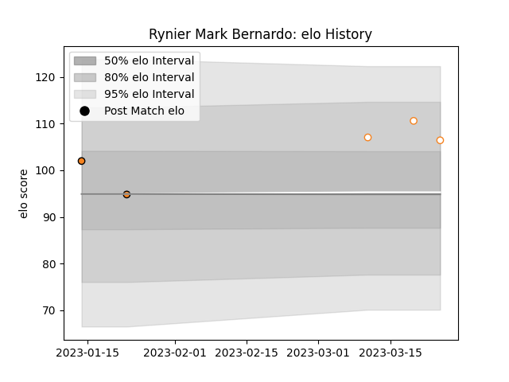

---  
layout: page  
title: Rynier Mark BERNARDO  
date: 2023-01-31 10:56:37.366792  
categories: player  
---
# Rynier Mark BERNARDO

## Positions: L

## Current elo: 104.0

## Current Percentile: 75.0

# Elo History

# Match History

| Team                   |   Appearances |   Win Rate |
|:-----------------------|--------------:|-----------:|
| Ospreys                |            31 |   0.548387 |
| Cheetahs               |            24 |   0.541667 |
| Free State Cheetahs    |            19 |   0.552632 |
| Southern Kings         |            10 |   0.15     |
| Eastern Province Kings |             9 |   0.777778 |
| Scarlets               |             8 |   0.5      |
| Yokohama Canon Eagles  |             7 |   0.428571 |

| Opponent                 |   Matches |   Win Rate |
|:-------------------------|----------:|-----------:|
| Benetton Treviso         |         7 |   0.714286 |
| Scarlets                 |         6 |   0.333333 |
| Dragons                  |         6 |   0.666667 |
| Pumas                    |         5 |   0.4      |
| Munster                  |         5 |   0.6      |
| Connacht                 |         5 |   0.4      |
| Griquas                  |         4 |   0.5      |
| Edinburgh                |         4 |   0.75     |
| Ulster                   |         4 |   0.25     |
| Cardiff Blues            |         3 |   0.666667 |
| Southern Kings           |         3 |   1        |
| Western Province         |         3 |   0.666667 |
| Blue Bulls               |         3 |   0.666667 |
| Northampton Saints       |         3 |   0        |
| Natal Sharks             |         3 |   0.333333 |
| Leinster                 |         3 |   0.333333 |
| Zebre                    |         3 |   1        |
| Saitama Wild Knights     |         2 |   0        |
| SWD Eagles               |         2 |   1        |
| Racing 92                |         2 |   0.25     |
| Pau                      |         2 |   1        |
| Ospreys                  |         2 |   0.5      |
| Leopards                 |         2 |   0.5      |
| Glasgow Warriors         |         2 |   0.25     |
| Border Bulldogs          |         2 |   1        |
| Bulls                    |         2 |   0        |
| Cheetahs                 |         2 |   0        |
| Griffons                 |         2 |   1        |
| Golden Lions             |         2 |   0.75     |
| Mie Honda Heat           |         1 |   0        |
| Brumbies                 |         1 |   0.5      |
| Stormers                 |         1 |   0        |
| Saracens                 |         1 |   0        |
| Crusaders                |         1 |   0        |
| Gloucester Rugby         |         1 |   0        |
| Mitsubishi Dynaboars     |         1 |   1        |
| Green Rockets Tokatsu    |         1 |   1        |
| Hurricanes               |         1 |   0        |
| New South Wales Waratahs |         1 |   0        |
| Kobelco Kobe Steelers    |         1 |   0        |
| Melbourne Rebels         |         1 |   1        |
| Munakata Sanix Blues     |         1 |   1        |
| Bath Rugby               |         1 |   1        |