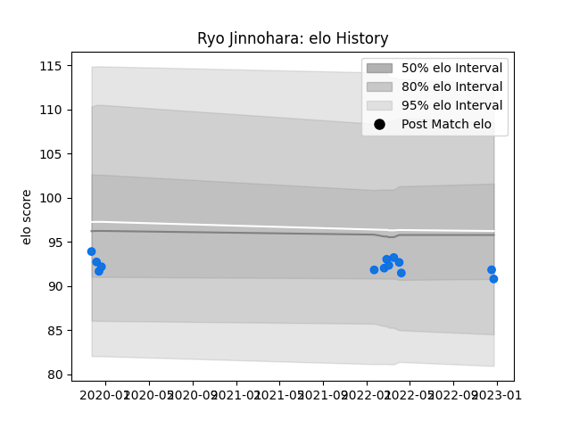

---  
layout: page  
title: Ryo Jinnohara  
date: 2022-12-28 12:52:53.121533  
categories: player  
---
# Ryo Jinnohara

## Positions: P

## Current elo: 91.0

## Current Percentile: 28.0

# Elo History

# Match History

| Team                |   Appearances |   Win Rate |
|:--------------------|--------------:|-----------:|
| Shimizu Blue Sharks |            13 |   0.230769 |

| Opponent                         |   Matches |   Win Rate |
|:---------------------------------|----------:|-----------:|
| Kyuden Voltex                    |         3 |   0.333333 |
| Toyota Industries Shuttles Aichi |         3 |   0        |
| Chugoku Red Regulions            |         2 |   1        |
| Coca-Cola Red Sparks             |         1 |   0        |
| Kurita Water Gush                |         1 |   0        |
| Mazda Blue Zoomers               |         1 |   0        |
| Munakata Sanix Blues             |         1 |   0        |
| Urayasu D-Rocks                  |         1 |   0        |