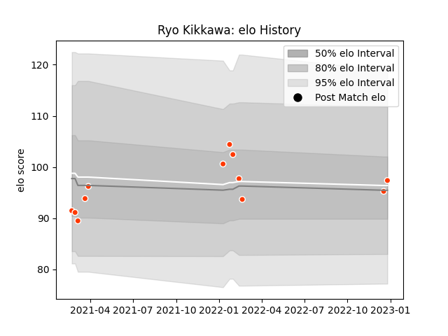

---  
layout: page  
title: Ryo Kikkawa  
date: 2022-12-18 16:16:03.653165  
categories: player  
---
# Ryo Kikkawa

## Positions: FB, W

## Current elo: 97.0

## Current Percentile: 52.0

# Elo History

# Match History

| Team              |   Appearances |   Win Rate |
|:------------------|--------------:|-----------:|
| Hino Red Dolphins |            10 |        0.4 |

| Opponent                        |   Matches |   Win Rate |
|:--------------------------------|----------:|-----------:|
| Kamaishi Seawaves               |         2 |          1 |
| Green Rockets Tokatsu           |         1 |          1 |
| Hanazono Kintetsu Liners        |         1 |          0 |
| Kobelco Kobe Steelers           |         1 |          0 |
| Mie Honda Heat                  |         1 |          0 |
| Mitsubishi Dynaboars            |         1 |          0 |
| NTT Docomo Red Hurricanes Osaka |         1 |          0 |
| Shizuoka Blue Revs              |         1 |          0 |
| Skyactivs Hiroshima             |         1 |          1 |