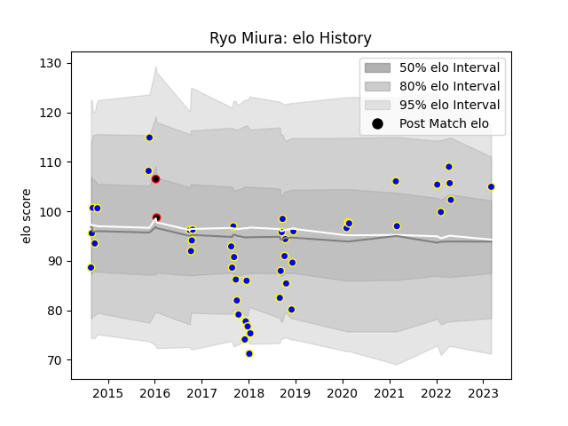

---  
layout: page  
title: Ryo Miura  
date: 2023-03-09 10:09:59.667531  
categories: player  
---
# Ryo Miura

## Positions: H

## Current elo: 105.0

## Current Percentile: 75.0

# Elo History

# Match History

| Team                            |   Appearances |   Win Rate |
|:--------------------------------|--------------:|-----------:|
| Urayasu D-Rocks                 |            45 |   0.588889 |
| NTT Docomo Red Hurricanes Osaka |             2 |   0        |

| Opponent                          |   Matches |   Win Rate |
|:----------------------------------|----------:|-----------:|
| Saitama Wild Knights              |         5 |   0.2      |
| Toyota Verblitz                   |         4 |   0.25     |
| Toyota Industries Shuttles Aichi  |         4 |   1        |
| Shizuoka Blue Revs                |         4 |   0.25     |
| Black Rams Tokyo                  |         3 |   0.666667 |
| Mie Honda Heat                    |         3 |   0.666667 |
| Toshiba Brave Lupus Tokyo         |         3 |   0.666667 |
| Munakata Sanix Blues              |         3 |   1        |
| Kobelco Kobe Steelers             |         3 |   0.5      |
| Green Rockets Tokatsu             |         3 |   0.666667 |
| Yokohama Canon Eagles             |         3 |   0.666667 |
| Coca-Cola Red Sparks              |         2 |   0.5      |
| Kubota Spears Funabashi Tokyo-Bay |         2 |   0.5      |
| Tokyo Sungoliath                  |         2 |   0        |
| Shimizu Blue Sharks               |         1 |   1        |
| Hino Red Dolphins                 |         1 |   1        |
| Hanazono Kintetsu Liners          |         1 |   1        |