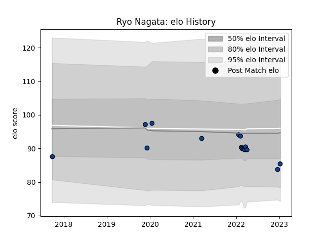

---  
layout: page  
title: Ryo Nagata  
date: 2023-03-21 18:16:41.370806  
categories: player  
---
# Ryo Nagata

Last updated: 2023-03-21
## Positions: H

## Current elo: 88.0

## Current Percentile: None

# Elo History

# Match History

| Team                |   Appearances |   Win Rate |
|:--------------------|--------------:|-----------:|
| Skyactivs Hiroshima |            14 |   0.214286 |
| Mazda Blue Zoomers  |             4 |   0.5      |

| Opponent                         |   Matches |   Win Rate |
|:---------------------------------|----------:|-----------:|
| Hanazono Kintetsu Liners         |         3 |        0   |
| Kamaishi Seawaves                |         2 |        0.5 |
| Kurita Water Gush                |         2 |        0.5 |
| Mie Honda Heat                   |         2 |        0   |
| Mitsubishi Dynaboars             |         2 |        0   |
| NTT Docomo Red Hurricanes Osaka  |         2 |        0   |
| Chugoku Red Regulions            |         1 |        1   |
| Hino Red Dolphins                |         1 |        0   |
| Kyuden Voltex                    |         1 |        1   |
| Shimizu Blue Sharks              |         1 |        1   |
| Toyota Industries Shuttles Aichi |         1 |        0   |