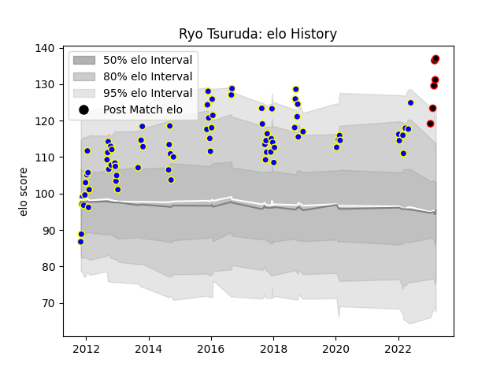

---  
layout: page  
title: Ryo Tsuruda  
date: 2023-03-21 18:34:52.567171  
categories: player  
---
# Ryo Tsuruda

Last updated: 2023-03-21
## Positions: W, SH

## Current elo: 137.0

## Current Percentile: 98.0

# Elo History

# Match History

| Team                            |   Appearances |   Win Rate |
|:--------------------------------|--------------:|-----------:|
| Urayasu D-Rocks                 |            76 |   0.526316 |
| NTT Docomo Red Hurricanes Osaka |             6 |   1        |

| Opponent                          |   Matches |   Win Rate |
|:----------------------------------|----------:|-----------:|
| Black Rams Tokyo                  |         7 |   0.785714 |
| Toyota Verblitz                   |         6 |   0.166667 |
| Kobelco Kobe Steelers             |         6 |   0.416667 |
| Toshiba Brave Lupus Tokyo         |         6 |   0.5      |
| Saitama Wild Knights              |         5 |   0.4      |
| Kubota Spears Funabashi Tokyo-Bay |         5 |   0.2      |
| Munakata Sanix Blues              |         5 |   1        |
| Green Rockets Tokatsu             |         4 |   0.25     |
| Hanazono Kintetsu Liners          |         4 |   0.25     |
| Toyota Industries Shuttles Aichi  |         4 |   1        |
| Tokyo Sungoliath                  |         4 |   0        |
| Shizuoka Blue Revs                |         4 |   0        |
| Skyactivs Hiroshima               |         3 |   1        |
| Yokohama Canon Eagles             |         3 |   1        |
| NTT Docomo Red Hurricanes Osaka   |         3 |   1        |
| Mie Honda Heat                    |         3 |   0.666667 |
| Kyuden Voltex                     |         3 |   1        |
| Hino Red Dolphins                 |         2 |   1        |
| Coca-Cola Red Sparks              |         2 |   1        |
| Chugoku Red Regulions             |         1 |   1        |
| Kurita Water Gush                 |         1 |   1        |
| Mitsubishi Dynaboars              |         1 |   0        |