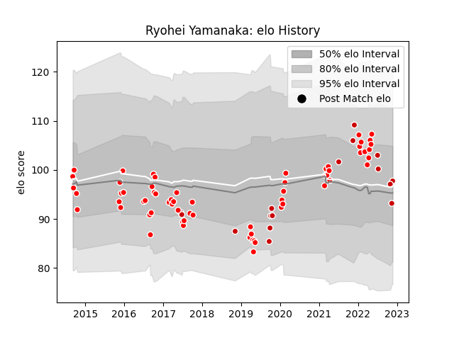

---  
layout: page  
title: Ryohei Yamanaka  
date: 2022-11-15 23:38:21.993032  
categories: player  
---
# Ryohei Yamanaka

## Positions: FB, C

## Country: Japan

## Current elo: 93.0

## Current Percentile: 55.0

# Elo History

# Match History

| Team                  |   Appearances |   Win Rate |
|:----------------------|--------------:|-----------:|
| Kobelco Kobe Steelers |            46 |   0.73913  |
| Sunwolves             |            18 |   0.166667 |
| Japan                 |            15 |   0.333333 |

| Opponent                          |   Matches |   Win Rate |
|:----------------------------------|----------:|-----------:|
| Yokohama Canon Eagles             |         8 |   0.75     |
| Green Rockets Tokatsu             |         4 |   1        |
| Shizuoka Blue Revs                |         4 |   1        |
| Saitama Wild Knights              |         4 |   0.125    |
| NTT Docomo Red Hurricanes Osaka   |         4 |   0.75     |
| Black Rams Tokyo                  |         3 |   1        |
| Urayasu D-Rocks                   |         3 |   0.666667 |
| Toyota Verblitz                   |         3 |   0.5      |
| Tokyo Sungoliath                  |         3 |   0.666667 |
| Ireland                           |         3 |   0.333333 |
| New South Wales Waratahs          |         2 |   0.5      |
| Toyota Industries Shuttles Aichi  |         2 |   1        |
| Toshiba Brave Lupus Tokyo         |         2 |   0.5      |
| Stormers                          |         2 |   0        |
| Sharks                            |         2 |   0        |
| Scotland                          |         2 |   0.5      |
| New Zealand                       |         2 |   0        |
| Coca-Cola Red Sparks              |         2 |   1        |
| Kubota Spears Funabashi Tokyo-Bay |         2 |   0.5      |
| France                            |         2 |   0        |
| Bulls                             |         2 |   0.5      |
| Hurricanes                        |         2 |   0        |
| Lions                             |         2 |   0        |
| British and Irish Lions           |         1 |   0        |
| Highlanders                       |         1 |   0        |
| Hino Red Dolphins                 |         1 |   1        |
| Jaguares                          |         1 |   0        |
| South Africa                      |         1 |   0        |
| Blues                             |         1 |   1        |
| Mie Honda Heat                    |         1 |   1        |
| Samoa                             |         1 |   1        |
| Brumbies                          |         1 |   0        |
| Russia                            |         1 |   1        |
| Queensland Reds                   |         1 |   0        |
| England                           |         1 |   0        |
| Melbourne Rebels                  |         1 |   0        |
| Portugal                          |         1 |   1        |