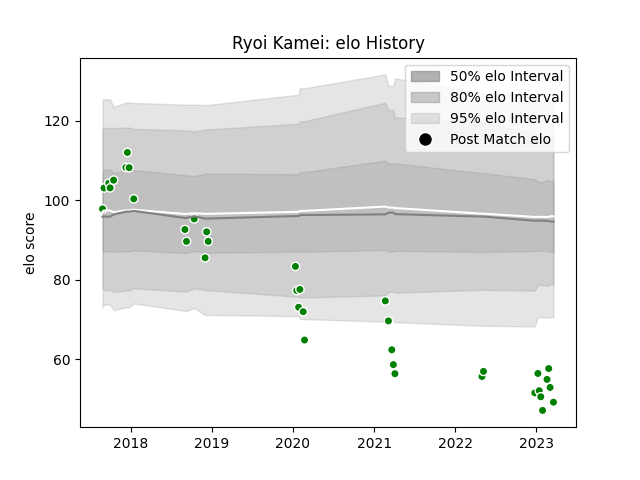

---  
layout: page  
title: Ryoi Kamei  
date: 2023-03-21 18:07:48.576814  
categories: player  
---
# Ryoi Kamei

Last updated: 2023-03-21
## Positions: FL

## Current elo: 49.0

## Current Percentile: 0.0

# Elo History

# Match History

| Team                  |   Appearances |   Win Rate |
|:----------------------|--------------:|-----------:|
| Green Rockets Tokatsu |            37 |   0.243243 |

| Opponent                          |   Matches |   Win Rate |
|:----------------------------------|----------:|-----------:|
| Black Rams Tokyo                  |         5 |   0        |
| Yokohama Canon Eagles             |         4 |   0.25     |
| Hino Red Dolphins                 |         3 |   0.333333 |
| Kobelco Kobe Steelers             |         3 |   0        |
| Tokyo Sungoliath                  |         3 |   0        |
| Coca-Cola Red Sparks              |         2 |   1        |
| Kubota Spears Funabashi Tokyo-Bay |         2 |   0.5      |
| Mitsubishi Dynaboars              |         2 |   0.5      |
| Munakata Sanix Blues              |         2 |   0.5      |
| Saitama Wild Knights              |         2 |   0        |
| Shizuoka Blue Revs                |         2 |   0        |
| Toyota Industries Shuttles Aichi  |         2 |   0.5      |
| Toyota Verblitz                   |         2 |   0        |
| Mie Honda Heat                    |         1 |   0        |
| NTT Docomo Red Hurricanes Osaka   |         1 |   0        |
| Toshiba Brave Lupus Tokyo         |         1 |   1        |