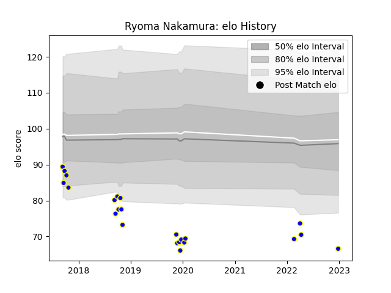

---  
layout: page  
title: Ryoma Nakamura  
date: 2023-01-17 11:32:30.057792  
categories: player  
---
# Ryoma Nakamura

## Positions: FH, FB

## Current elo: 65.0

## Current Percentile: 1.0

# Elo History

# Match History

| Team              |   Appearances |   Win Rate |
|:------------------|--------------:|-----------:|
| Kamaishi Seawaves |            24 |     0.3125 |

| Opponent                         |   Matches |   Win Rate |
|:---------------------------------|----------:|-----------:|
| Hanazono Kintetsu Liners         |         4 |   0        |
| Kyuden Voltex                    |         3 |   0.333333 |
| Mie Honda Heat                   |         3 |   0        |
| Chugoku Red Regulions            |         2 |   1        |
| Kurita Water Gush                |         2 |   0.5      |
| Mazda Blue Zoomers               |         2 |   0.5      |
| Mitsubishi Dynaboars             |         2 |   0        |
| Shimizu Blue Sharks              |         2 |   1        |
| Coca-Cola Red Sparks             |         1 |   0.5      |
| Hino Red Dolphins                |         1 |   0        |
| NTT Docomo Red Hurricanes Osaka  |         1 |   0        |
| Toyota Industries Shuttles Aichi |         1 |   0        |