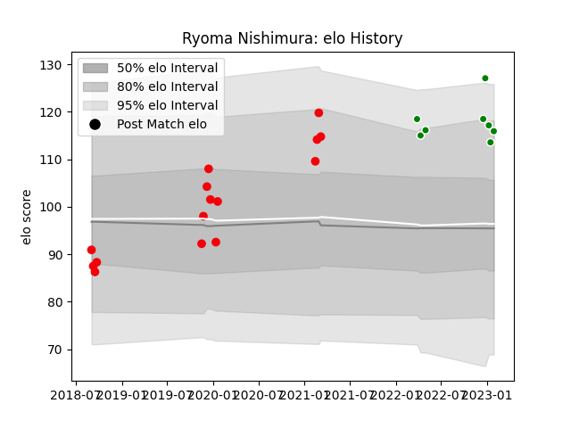

---  
layout: page  
title: Ryoma Nishimura  
date: 2022-12-18 16:21:27.138188  
categories: player  
---
# Ryoma Nishimura

## Positions: L

## Current elo: 108.0

## Current Percentile: 81.0

# Elo History

# Match History

| Team                 |   Appearances |   Win Rate |
|:---------------------|--------------:|-----------:|
| Coca-Cola Red Sparks |            13 |   0.653846 |
| Toyota Verblitz      |             3 |   0.666667 |

| Opponent                         |   Matches |   Win Rate |
|:---------------------------------|----------:|-----------:|
| Kyuden Voltex                    |         2 |        1   |
| Shizuoka Blue Revs               |         2 |        0.5 |
| Toyota Industries Shuttles Aichi |         2 |        0.5 |
| Chugoku Red Regulions            |         1 |        1   |
| Green Rockets Tokatsu            |         1 |        1   |
| Hanazono Kintetsu Liners         |         1 |        0   |
| Kamaishi Seawaves                |         1 |        0.5 |
| Kurita Water Gush                |         1 |        1   |
| Mazda Blue Zoomers               |         1 |        1   |
| Saitama Wild Knights             |         1 |        0   |
| Shimizu Blue Sharks              |         1 |        1   |
| Skyactivs Hiroshima              |         1 |        1   |
| Toshiba Brave Lupus Tokyo        |         1 |        0   |