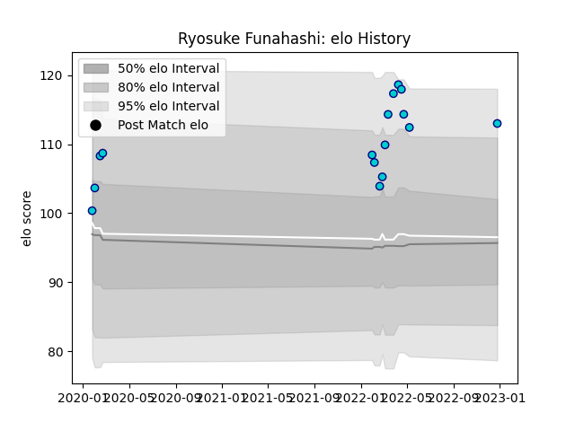

---  
layout: page  
title: Ryosuke Funahashi  
date: 2023-01-13 11:35:57.889857  
categories: player  
---
# Ryosuke Funahashi

## Positions: L, FL

## Current elo: 127.0

## Current Percentile: 94.0

# Elo History

# Match History

| Team               |   Appearances |   Win Rate |
|:-------------------|--------------:|-----------:|
| Shizuoka Blue Revs |            17 |   0.470588 |

| Opponent                          |   Matches |   Win Rate |
|:----------------------------------|----------:|-----------:|
| Toshiba Brave Lupus Tokyo         |         3 |          0 |
| Black Rams Tokyo                  |         2 |          1 |
| NTT Docomo Red Hurricanes Osaka   |         2 |          1 |
| Saitama Wild Knights              |         2 |          0 |
| Green Rockets Tokatsu             |         1 |          1 |
| Hino Red Dolphins                 |         1 |          1 |
| Kubota Spears Funabashi Tokyo-Bay |         1 |          0 |
| Mitsubishi Dynaboars              |         1 |          1 |
| Tokyo Sungoliath                  |         1 |          0 |
| Toyota Verblitz                   |         1 |          0 |
| Urayasu D-Rocks                   |         1 |          1 |
| Yokohama Canon Eagles             |         1 |          0 |