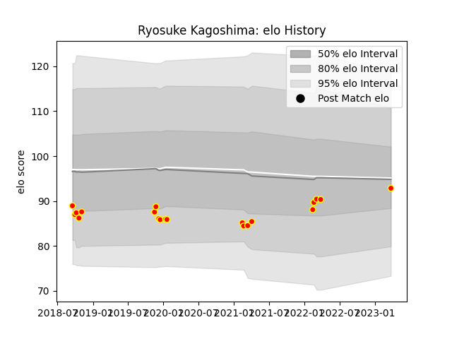

---  
layout: page  
title: Ryosuke Kagoshima  
date: 2023-03-27 11:36:49.436494  
categories: player  
---
# Ryosuke Kagoshima

Last updated: 2023-03-27
## Positions: P

## Current elo: 93.0

## Current Percentile: None

# Elo History

# Match History

| Team          |   Appearances |   Win Rate |
|:--------------|--------------:|-----------:|
| Kyuden Voltex |            20 |       0.25 |

| Opponent                         |   Matches |   Win Rate |
|:---------------------------------|----------:|-----------:|
| Toyota Industries Shuttles Aichi |         4 |        0   |
| Chugoku Red Regulions            |         3 |        1   |
| Coca-Cola Red Sparks             |         2 |        0   |
| Hanazono Kintetsu Liners         |         2 |        0   |
| Kamaishi Seawaves                |         2 |        0.5 |
| Kurita Water Gush                |         2 |        0   |
| Mazda Blue Zoomers               |         1 |        0   |
| Mitsubishi Dynaboars             |         1 |        0   |
| NTT Docomo Red Hurricanes Osaka  |         1 |        0   |
| Shimizu Blue Sharks              |         1 |        0   |
| Skyactivs Hiroshima              |         1 |        1   |