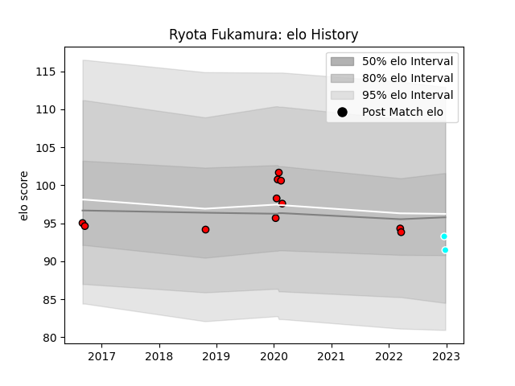

---  
layout: page  
title: Ryota Fukamura  
date: 2022-12-31 16:28:28.151966  
categories: player  
---
# Ryota Fukamura

## Positions: P

## Current elo: 92.0

## Current Percentile: 44.0

# Elo History

# Match History

| Team                             |   Appearances |   Win Rate |
|:---------------------------------|--------------:|-----------:|
| Toshiba Brave Lupus Tokyo        |            11 |   0.545455 |
| Toyota Industries Shuttles Aichi |             2 |   1        |

| Opponent                          |   Matches |   Win Rate |
|:----------------------------------|----------:|-----------:|
| Green Rockets Tokatsu             |         2 |        1   |
| Mie Honda Heat                    |         2 |        0.5 |
| Hino Red Dolphins                 |         1 |        1   |
| Kobelco Kobe Steelers             |         1 |        0   |
| Kubota Spears Funabashi Tokyo-Bay |         1 |        0   |
| Mitsubishi Dynaboars              |         1 |        1   |
| NTT Docomo Red Hurricanes Osaka   |         1 |        1   |
| Saitama Wild Knights              |         1 |        0   |
| Shimizu Blue Sharks               |         1 |        1   |
| Shizuoka Blue Revs                |         1 |        0   |
| Tokyo Sungoliath                  |         1 |        1   |