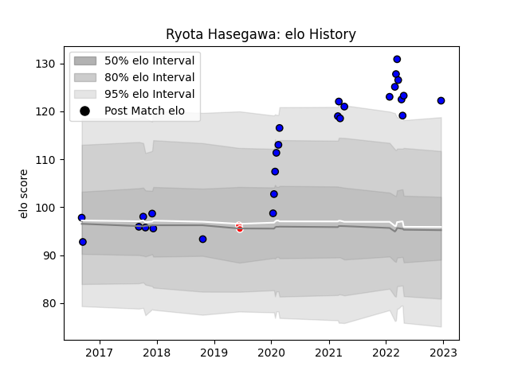

---  
layout: page  
title: Ryota Hasegawa  
date: 2022-12-18 16:15:39.675116  
categories: player  
---
# Ryota Hasegawa

## Positions: FL, L

## Current elo: 122.0

## Current Percentile: 97.0

# Elo History

# Match History

| Team                 |   Appearances |   Win Rate |
|:---------------------|--------------:|-----------:|
| Saitama Wild Knights |            27 |   0.962963 |
| Sunwolves            |             2 |   0        |

| Opponent                          |   Matches |   Win Rate |
|:----------------------------------|----------:|-----------:|
| Yokohama Canon Eagles             |         5 |   1        |
| NTT Docomo Red Hurricanes Osaka   |         3 |   1        |
| Tokyo Sungoliath                  |         3 |   0.666667 |
| Toyota Verblitz                   |         2 |   1        |
| Toshiba Brave Lupus Tokyo         |         2 |   1        |
| Urayasu D-Rocks                   |         1 |   1        |
| Toyota Industries Shuttles Aichi  |         1 |   1        |
| Stormers                          |         1 |   0        |
| Shizuoka Blue Revs                |         1 |   1        |
| Black Rams Tokyo                  |         1 |   1        |
| Coca-Cola Red Sparks              |         1 |   1        |
| Mitsubishi Dynaboars              |         1 |   1        |
| Kubota Spears Funabashi Tokyo-Bay |         1 |   1        |
| Kobelco Kobe Steelers             |         1 |   1        |
| Jaguares                          |         1 |   0        |
| Hino Red Dolphins                 |         1 |   1        |
| Hanazono Kintetsu Liners          |         1 |   1        |
| Green Rockets Tokatsu             |         1 |   1        |
| Munakata Sanix Blues              |         1 |   1        |