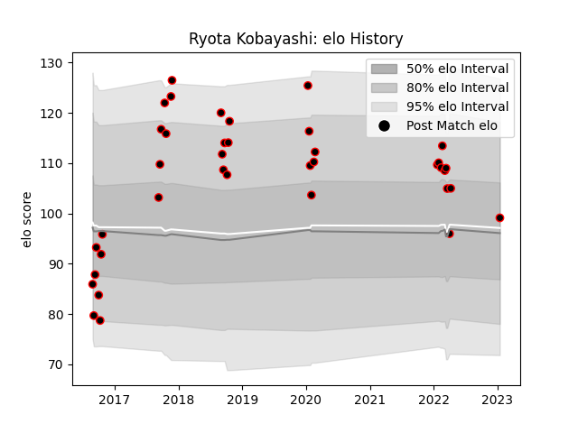

---  
layout: page  
title: Ryota Kobayashi  
date: 2023-01-17 11:28:34.895251  
categories: player  
---
# Ryota Kobayashi

## Positions: FL

## Current elo: 99.0

## Current Percentile: 72.0

# Elo History

# Match History

| Team           |   Appearances |   Win Rate |
|:---------------|--------------:|-----------:|
| Mie Honda Heat |            38 |   0.486842 |

| Opponent                          |   Matches |   Win Rate |
|:----------------------------------|----------:|-----------:|
| Hino Red Dolphins                 |         4 |   1        |
| Kubota Spears Funabashi Tokyo-Bay |         3 |   0        |
| Toshiba Brave Lupus Tokyo         |         3 |   0.333333 |
| Mitsubishi Dynaboars              |         3 |   0.666667 |
| Black Rams Tokyo                  |         2 |   0.5      |
| Toyota Verblitz                   |         2 |   0        |
| Skyactivs Hiroshima               |         2 |   1        |
| Shizuoka Blue Revs                |         2 |   0        |
| Yokohama Canon Eagles             |         2 |   0.75     |
| Kamaishi Seawaves                 |         2 |   1        |
| Hanazono Kintetsu Liners          |         2 |   0        |
| Coca-Cola Red Sparks              |         2 |   0.5      |
| Kyuden Voltex                     |         1 |   1        |
| Chubu Electric Power              |         1 |   1        |
| Kobelco Kobe Steelers             |         1 |   0        |
| Munakata Sanix Blues              |         1 |   0        |
| Saitama Wild Knights              |         1 |   0        |
| Tokyo Sungoliath                  |         1 |   0        |
| Chugoku Red Regulions             |         1 |   1        |
| Urayasu D-Rocks                   |         1 |   0        |
| Mazda Blue Zoomers                |         1 |   1        |