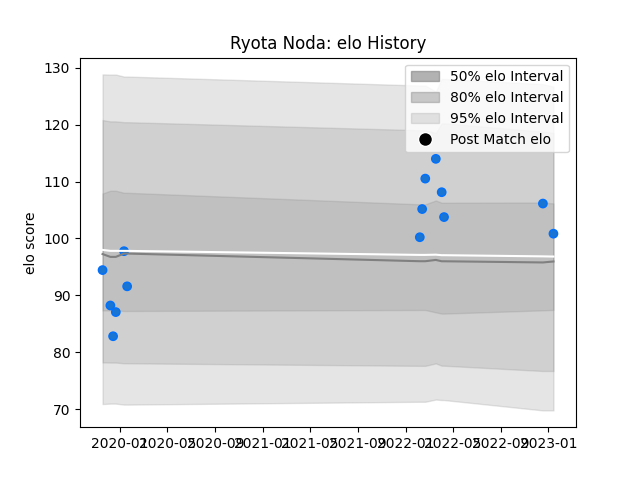

---  
layout: page  
title: Ryota Noda  
date: 2023-01-17 11:46:02.149678  
categories: player  
---
# Ryota Noda

## Positions: W, C

## Current elo: 101.0

## Current Percentile: 75.0

# Elo History

# Match History

| Team                |   Appearances |   Win Rate |
|:--------------------|--------------:|-----------:|
| Shimizu Blue Sharks |            14 |   0.214286 |

| Opponent                         |   Matches |   Win Rate |
|:---------------------------------|----------:|-----------:|
| Toyota Industries Shuttles Aichi |         4 |        0   |
| Kamaishi Seawaves                |         2 |        0   |
| Kurita Water Gush                |         2 |        0.5 |
| Munakata Sanix Blues             |         2 |        0.5 |
| Chugoku Red Regulions            |         1 |        1   |
| Coca-Cola Red Sparks             |         1 |        0   |
| Hanazono Kintetsu Liners         |         1 |        0   |
| Kyuden Voltex                    |         1 |        0   |