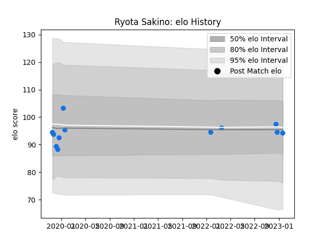

---  
layout: page  
title: Ryota Sakino  
date: 2022-12-28 12:53:54.336902  
categories: player  
---
# Ryota Sakino

## Positions: L

## Current elo: 92.0

## Current Percentile: 49.0

# Elo History

# Match History

| Team                |   Appearances |   Win Rate |
|:--------------------|--------------:|-----------:|
| Shimizu Blue Sharks |            11 |  0.0909091 |

| Opponent                         |   Matches |   Win Rate |
|:---------------------------------|----------:|-----------:|
| Kyuden Voltex                    |         2 |          0 |
| Toyota Industries Shuttles Aichi |         2 |          0 |
| Chugoku Red Regulions            |         1 |          1 |
| Coca-Cola Red Sparks             |         1 |          0 |
| Hanazono Kintetsu Liners         |         1 |          0 |
| Kamaishi Seawaves                |         1 |          0 |
| Kurita Water Gush                |         1 |          0 |
| Mazda Blue Zoomers               |         1 |          0 |
| Urayasu D-Rocks                  |         1 |          0 |