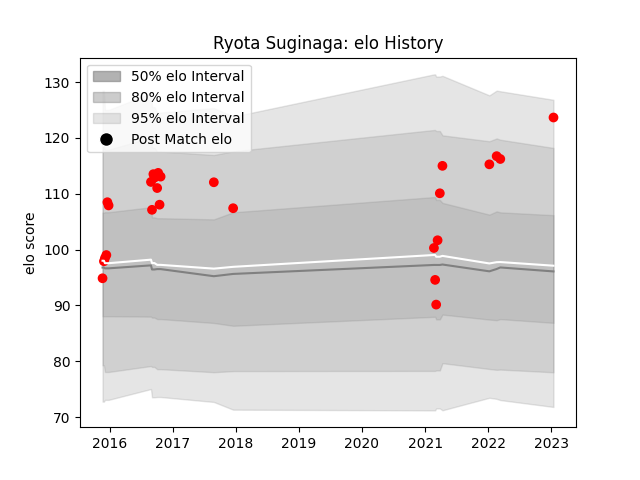

---  
layout: page  
title: Ryota Suginaga  
date: 2023-01-17 11:43:48.623122  
categories: player  
---
# Ryota Suginaga

## Positions: FL

## Current elo: 124.0

## Current Percentile: None

# Elo History

# Match History

| Team                  |   Appearances |   Win Rate |
|:----------------------|--------------:|-----------:|
| Yokohama Canon Eagles |            26 |   0.538462 |

| Opponent                         |   Matches |   Win Rate |
|:---------------------------------|----------:|-----------:|
| Green Rockets Tokatsu            |         4 |   0.75     |
| Shizuoka Blue Revs               |         4 |   0.5      |
| NTT Docomo Red Hurricanes Osaka  |         3 |   0.666667 |
| Saitama Wild Knights             |         3 |   0        |
| Black Rams Tokyo                 |         2 |   0.5      |
| Coca-Cola Red Sparks             |         2 |   1        |
| Kobelco Kobe Steelers            |         2 |   0        |
| Toyota Industries Shuttles Aichi |         2 |   1        |
| Hanazono Kintetsu Liners         |         1 |   1        |
| Tokyo Sungoliath                 |         1 |   0        |
| Toshiba Brave Lupus Tokyo        |         1 |   0        |
| Toyota Verblitz                  |         1 |   1        |