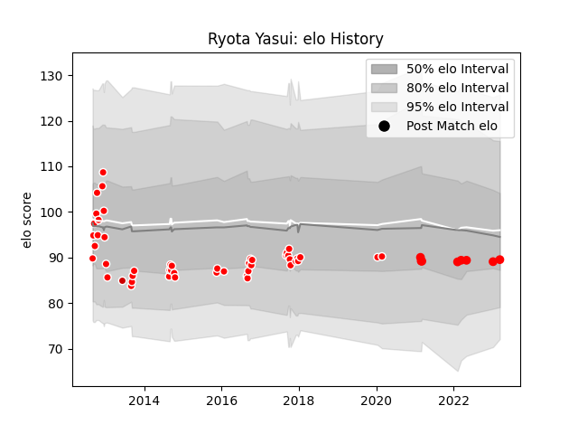

---  
layout: page  
title: Ryota Yasui  
date: 2023-03-21 18:27:18.596088  
categories: player  
---
# Ryota Yasui

Last updated: 2023-03-21
## Positions: FL, L

## Country: Japan

## Current elo: 90.0

## Current Percentile: 33.0

# Elo History

# Match History

| Team                  |   Appearances |   Win Rate |
|:----------------------|--------------:|-----------:|
| Kobelco Kobe Steelers |            47 |   0.755319 |
| Yokohama Canon Eagles |             8 |   0.25     |
| Japan                 |             1 |   0        |

| Opponent                          |   Matches |   Win Rate |
|:----------------------------------|----------:|-----------:|
| Yokohama Canon Eagles             |         6 |   0.833333 |
| Tokyo Sungoliath                  |         5 |   0.2      |
| NTT Docomo Red Hurricanes Osaka   |         5 |   0.8      |
| Saitama Wild Knights              |         4 |   0        |
| Green Rockets Tokatsu             |         4 |   1        |
| Toshiba Brave Lupus Tokyo         |         4 |   0.75     |
| Toyota Verblitz                   |         4 |   0.5      |
| Shizuoka Blue Revs                |         3 |   0.666667 |
| Urayasu D-Rocks                   |         3 |   0.833333 |
| Black Rams Tokyo                  |         3 |   1        |
| Hanazono Kintetsu Liners          |         2 |   1        |
| Kobelco Kobe Steelers             |         2 |   0        |
| Kubota Spears Funabashi Tokyo-Bay |         2 |   0.5      |
| Kyuden Voltex                     |         2 |   1        |
| Coca-Cola Red Sparks              |         2 |   1        |
| Toyota Industries Shuttles Aichi  |         2 |   1        |
| Mitsubishi Dynaboars              |         1 |   1        |
| Munakata Sanix Blues              |         1 |   1        |
| Wales                             |         1 |   0        |