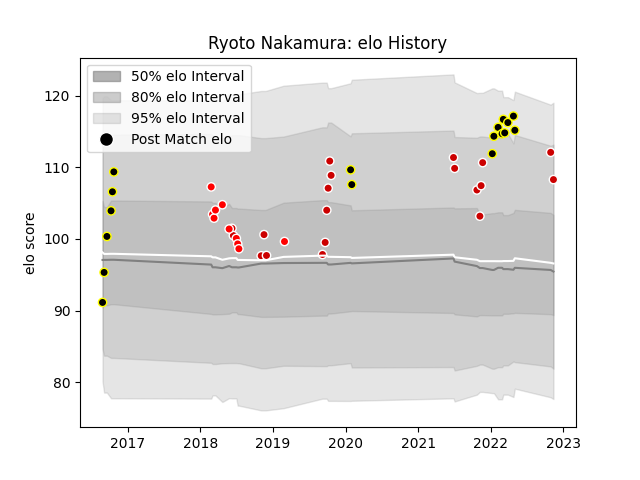

---  
layout: page  
title: Ryoto Nakamura  
date: 2022-11-16 11:34:56.478286  
categories: player  
---
# Ryoto Nakamura

## Positions: C

## Country: Japan

## Current elo: 108.0

## Current Percentile: 87.0

# Elo History

# Match History

| Team             |   Appearances |   Win Rate |
|:-----------------|--------------:|-----------:|
| Japan            |            19 |   0.368421 |
| Tokyo Sungoliath |            17 |   0.823529 |
| Sunwolves        |            10 |   0.1      |

| Opponent                          |   Matches |   Win Rate |
|:----------------------------------|----------:|-----------:|
| Ireland                           |         3 |   0.333333 |
| Italy                             |         2 |   0.5      |
| New South Wales Waratahs          |         2 |   0        |
| Russia                            |         2 |   1        |
| Saitama Wild Knights              |         2 |   0.5      |
| Melbourne Rebels                  |         2 |   0        |
| Scotland                          |         2 |   0.5      |
| Kobelco Kobe Steelers             |         2 |   0.5      |
| New Zealand                       |         2 |   0        |
| Green Rockets Tokatsu             |         2 |   1        |
| England                           |         2 |   0        |
| South Africa                      |         2 |   0        |
| Toshiba Brave Lupus Tokyo         |         2 |   0.5      |
| Sharks                            |         1 |   0        |
| Portugal                          |         1 |   1        |
| Samoa                             |         1 |   1        |
| Toyota Industries Shuttles Aichi  |         1 |   1        |
| Queensland Reds                   |         1 |   0        |
| Toyota Verblitz                   |         1 |   1        |
| Australia                         |         1 |   0        |
| Munakata Sanix Blues              |         1 |   1        |
| NTT Docomo Red Hurricanes Osaka   |         1 |   1        |
| Black Rams Tokyo                  |         1 |   1        |
| Mie Honda Heat                    |         1 |   1        |
| Lions                             |         1 |   0        |
| Kubota Spears Funabashi Tokyo-Bay |         1 |   1        |
| Hanazono Kintetsu Liners          |         1 |   1        |
| Crusaders                         |         1 |   0        |
| Bulls                             |         1 |   1        |
| Brumbies                          |         1 |   0        |
| British and Irish Lions           |         1 |   0        |
| Yokohama Canon Eagles             |         1 |   1        |