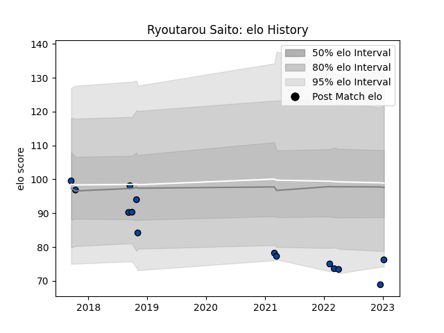

---  
layout: page  
title: Ryoutarou Saito  
date: 2023-01-13 11:26:09.305359  
categories: player  
---
# Ryoutarou Saito

## Positions: FH

## Current elo: 76.0

## Current Percentile: 4.0

# Elo History

# Match History

| Team                |   Appearances |   Win Rate |
|:--------------------|--------------:|-----------:|
| Mazda Blue Zoomers  |             7 |   0.285714 |
| Skyactivs Hiroshima |             7 |   0        |

| Opponent                         |   Matches |   Win Rate |
|:---------------------------------|----------:|-----------:|
| Hanazono Kintetsu Liners         |         3 |   0        |
| Kyuden Voltex                    |         3 |   0.333333 |
| Chugoku Red Regulions            |         2 |   0        |
| Mitsubishi Dynaboars             |         2 |   0        |
| Kamaishi Seawaves                |         1 |   1        |
| Kurita Water Gush                |         1 |   0        |
| NTT Docomo Red Hurricanes Osaka  |         1 |   0        |
| Toyota Industries Shuttles Aichi |         1 |   0        |