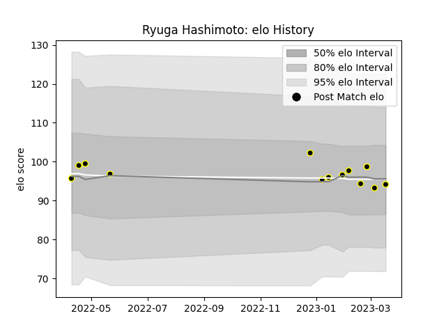

---  
layout: page  
title: Ryuga Hashimoto  
date: 2023-01-13 11:29:09.126003  
categories: player  
---
# Ryuga Hashimoto

## Positions: FL

## Current elo: 105.0

## Current Percentile: 68.0

# Elo History

# Match History

| Team             |   Appearances |   Win Rate |
|:-----------------|--------------:|-----------:|
| Tokyo Sungoliath |             6 |   0.833333 |

| Opponent                          |   Matches |   Win Rate |
|:----------------------------------|----------:|-----------:|
| Black Rams Tokyo                  |         1 |          1 |
| Green Rockets Tokatsu             |         1 |          1 |
| Kubota Spears Funabashi Tokyo-Bay |         1 |          0 |
| NTT Docomo Red Hurricanes Osaka   |         1 |          1 |
| Shizuoka Blue Revs                |         1 |          1 |
| Yokohama Canon Eagles             |         1 |          1 |