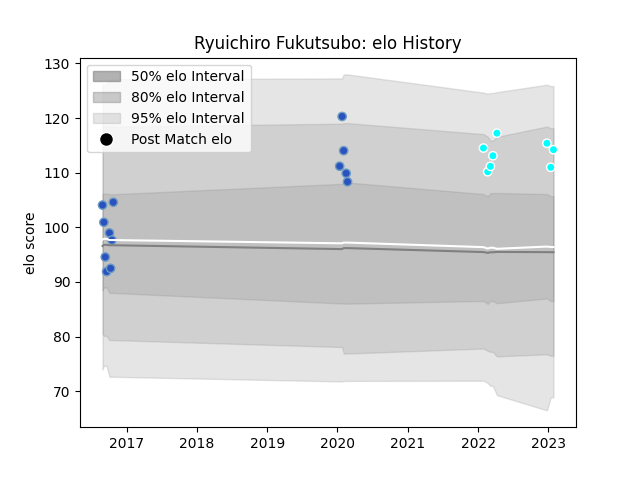

---  
layout: page  
title: Ryuichiro Fukutsubo  
date: 2023-03-21 18:22:30.295614  
categories: player  
---
# Ryuichiro Fukutsubo

Last updated: 2023-03-21
## Positions: L

## Current elo: 113.0

## Current Percentile: 88.0

# Elo History

# Match History

| Team                             |   Appearances |   Win Rate |
|:---------------------------------|--------------:|-----------:|
| Munakata Sanix Blues             |            32 |   0.34375  |
| Toyota Industries Shuttles Aichi |            11 |   0.727273 |

| Opponent                          |   Matches |   Win Rate |
|:----------------------------------|----------:|-----------:|
| Urayasu D-Rocks                   |         4 |   0        |
| Kubota Spears Funabashi Tokyo-Bay |         4 |   0        |
| Green Rockets Tokatsu             |         3 |   0.666667 |
| Hino Red Dolphins                 |         3 |   0.666667 |
| Mie Honda Heat                    |         3 |   0.333333 |
| Toyota Industries Shuttles Aichi  |         3 |   0.666667 |
| Tokyo Sungoliath                  |         3 |   0        |
| Chugoku Red Regulions             |         2 |   1        |
| Hanazono Kintetsu Liners          |         2 |   0.5      |
| Kamaishi Seawaves                 |         2 |   1        |
| Toyota Verblitz                   |         2 |   0        |
| Coca-Cola Red Sparks              |         2 |   1        |
| Shimizu Blue Sharks               |         2 |   1        |
| Shizuoka Blue Revs                |         2 |   0        |
| Toshiba Brave Lupus Tokyo         |         1 |   1        |
| Mitsubishi Dynaboars              |         1 |   0        |
| NTT Docomo Red Hurricanes Osaka   |         1 |   1        |
| Kurita Water Gush                 |         1 |   1        |
| Kobelco Kobe Steelers             |         1 |   0        |
| Yokohama Canon Eagles             |         1 |   0        |