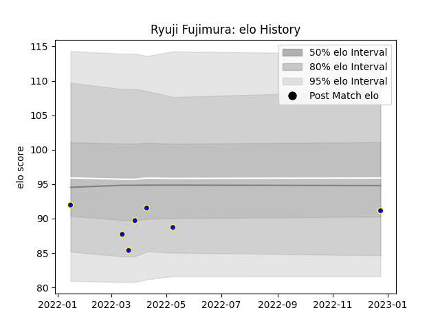

---  
layout: page  
title: Ryuji Fujimura  
date: 2023-01-17 11:30:05.118896  
categories: player  
---
# Ryuji Fujimura

## Positions: H

## Current elo: 94.0

## Current Percentile: 23.0

# Elo History

# Match History

| Team            |   Appearances |   Win Rate |
|:----------------|--------------:|-----------:|
| Urayasu D-Rocks |             8 |      0.375 |

| Opponent                          |   Matches |   Win Rate |
|:----------------------------------|----------:|-----------:|
| Black Rams Tokyo                  |         1 |          1 |
| Kobelco Kobe Steelers             |         1 |          0 |
| Kubota Spears Funabashi Tokyo-Bay |         1 |          0 |
| Saitama Wild Knights              |         1 |          0 |
| Shimizu Blue Sharks               |         1 |          1 |
| Shizuoka Blue Revs                |         1 |          0 |
| Tokyo Sungoliath                  |         1 |          0 |
| Toyota Industries Shuttles Aichi  |         1 |          1 |