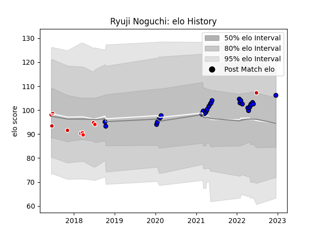

---  
layout: page  
title: Ryuji Noguchi  
date: 2023-01-13 11:36:22.662751  
categories: player  
---
# Ryuji Noguchi

## Positions: FB

## Country: Japan

## Current elo: 103.0

## Current Percentile: 64.0

# Elo History

# Match History

| Team                 |   Appearances |   Win Rate |
|:---------------------|--------------:|-----------:|
| Saitama Wild Knights |            26 |   0.942308 |
| Japan                |             6 |   0.5      |
| Sunwolves            |             4 |   0        |

| Opponent                          |   Matches |   Win Rate |
|:----------------------------------|----------:|-----------:|
| Yokohama Canon Eagles             |         4 |   1        |
| Kobelco Kobe Steelers             |         3 |   0.833333 |
| Toshiba Brave Lupus Tokyo         |         3 |   1        |
| Urayasu D-Rocks                   |         2 |   1        |
| Green Rockets Tokatsu             |         2 |   1        |
| Ireland                           |         2 |   0        |
| Kubota Spears Funabashi Tokyo-Bay |         2 |   1        |
| Shizuoka Blue Revs                |         2 |   1        |
| Black Rams Tokyo                  |         2 |   0.5      |
| NTT Docomo Red Hurricanes Osaka   |         2 |   1        |
| New South Wales Waratahs          |         1 |   0        |
| Uruguay                           |         1 |   1        |
| Toyota Verblitz                   |         1 |   1        |
| Romania                           |         1 |   1        |
| Australia                         |         1 |   0        |
| Mitsubishi Dynaboars              |         1 |   1        |
| Melbourne Rebels                  |         1 |   0        |
| Lions                             |         1 |   0        |
| Hino Red Dolphins                 |         1 |   1        |
| Georgia                           |         1 |   1        |
| Chiefs                            |         1 |   0        |
| Mie Honda Heat                    |         1 |   1        |