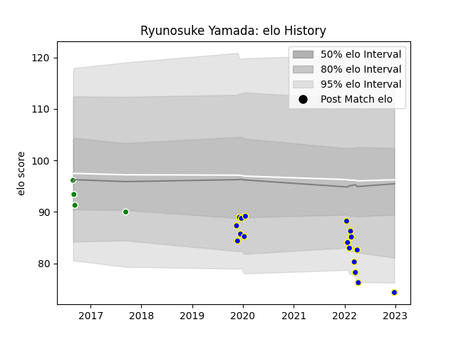

---  
layout: page  
title: Ryunosuke Yamada  
date: 2022-12-28 12:54:31.081616  
categories: player  
---
# Ryunosuke Yamada

## Positions: L

## Current elo: 74.0

## Current Percentile: 5.0

# Elo History

# Match History

| Team                  |   Appearances |   Win Rate |
|:----------------------|--------------:|-----------:|
| Kamaishi Seawaves     |            17 |   0.264706 |
| Green Rockets Tokatsu |             4 |   0        |

| Opponent                         |   Matches |   Win Rate |
|:---------------------------------|----------:|-----------:|
| Hanazono Kintetsu Liners         |         3 |        0   |
| Mie Honda Heat                   |         3 |        0   |
| Hino Red Dolphins                |         2 |        0   |
| Skyactivs Hiroshima              |         2 |        0.5 |
| Black Rams Tokyo                 |         1 |        0   |
| Coca-Cola Red Sparks             |         1 |        0.5 |
| Kobelco Kobe Steelers            |         1 |        0   |
| Kurita Water Gush                |         1 |        1   |
| Kyuden Voltex                    |         1 |        0   |
| Mazda Blue Zoomers               |         1 |        1   |
| Mitsubishi Dynaboars             |         1 |        0   |
| Shimizu Blue Sharks              |         1 |        1   |
| Toshiba Brave Lupus Tokyo        |         1 |        0   |
| Toyota Industries Shuttles Aichi |         1 |        0   |
| Urayasu D-Rocks                  |         1 |        0   |