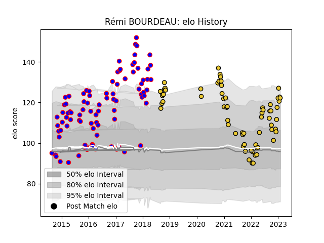

---  
layout: page  
title: Rémi BOURDEAU  
date: 2023-02-02 18:50:35.313274  
categories: player  
---
# Rémi BOURDEAU

## Positions: FL, N8

## Current elo: 135.0

## Current Percentile: 97.0

# Elo History

# Match History

| Team        |   Appearances |   Win Rate |
|:------------|--------------:|-----------:|
| Beziers     |            90 |   0.572222 |
| La Rochelle |            61 |   0.639344 |

| Opponent             |   Matches |   Win Rate |
|:---------------------|----------:|-----------:|
| Perpignan            |        11 |   0.636364 |
| Carcassonne          |         7 |   0.714286 |
| Bayonne              |         7 |   0.571429 |
| Biarritz Olympique   |         7 |   0.285714 |
| Racing 92            |         7 |   0.428571 |
| Narbonne             |         6 |   0.666667 |
| Lyon                 |         6 |   0.5      |
| Dax                  |         6 |   0.5      |
| Clermont Auvergne    |         5 |   0.4      |
| Agen                 |         5 |   1        |
| Stade Francais Paris |         5 |   0.4      |
| Bourgoin-Jallieu     |         5 |   0.8      |
| Aurillac             |         5 |   0.6      |
| Montpellier Herault  |         5 |   0.4      |
| Albi                 |         4 |   0.625    |
| Stade Toulousain     |         4 |   0.25     |
| Toulon               |         4 |   0.75     |
| Montauban            |         4 |   0.75     |
| Mont-de-Marsan       |         4 |   0.5      |
| Massy                |         4 |   0.75     |
| Colomiers            |         4 |   0.75     |
| Vannes               |         4 |   0.5      |
| Pau                  |         3 |   0.333333 |
| Grenoble             |         3 |   0.666667 |
| Soyaux-Angouleme     |         3 |   0.333333 |
| Castres Olympique    |         3 |   0.666667 |
| Brive                |         3 |   1        |
| Tarbes               |         3 |   0.333333 |
| Bordeaux Begles      |         3 |   0.666667 |
| Oyonnax              |         2 |   0.5      |
| Provence Rugby       |         2 |   1        |
| Northampton Saints   |         2 |   1        |
| Nevers               |         2 |   1        |
| Ulster               |         2 |   1        |
| RC Enisei            |         1 |   1        |