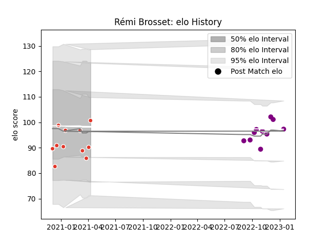

---  
layout: page  
title: Rémi Brosset  
date: 2022-12-18 16:34:33.808420  
categories: player  
---
# Rémi Brosset

## Positions: FB

## Current elo: 94.0

## Current Percentile: 48.0

# Elo History

# Match History

| Team               |   Appearances |   Win Rate |
|:-------------------|--------------:|-----------:|
| Biarritz Olympique |             9 |   0.5      |
| Soyaux-Angouleme   |             9 |   0.333333 |

| Opponent                   |   Matches |   Win Rate |
|:---------------------------|----------:|-----------:|
| Nevers                     |         3 |   0.333333 |
| Oyonnax                    |         3 |   0.333333 |
| Beziers                    |         2 |   0.5      |
| Grenoble                   |         2 |   0.5      |
| Mont-de-Marsan             |         2 |   0.25     |
| Valence Romans Drome Rugby |         2 |   0.5      |
| Agen                       |         1 |   1        |
| Biarritz Olympique         |         1 |   0        |
| Carcassonne                |         1 |   1        |
| Colomiers                  |         1 |   0        |