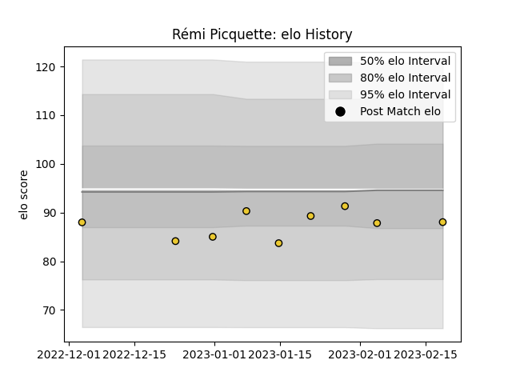

---  
layout: page  
title: Rémi Picquette  
date: 2023-02-24 02:21:31.149283  
categories: player  
---
# Rémi Picquette

## Positions: L

## Current elo: 88.0

## Current Percentile: 27.0

# Elo History

# Match History

| Team        |   Appearances |   Win Rate |
|:------------|--------------:|-----------:|
| La Rochelle |             9 |   0.555556 |

| Opponent             |   Matches |   Win Rate |
|:---------------------|----------:|-----------:|
| Bordeaux Begles      |         1 |          0 |
| Castres Olympique    |         1 |          1 |
| Lyon                 |         1 |          0 |
| Northampton Saints   |         1 |          1 |
| Perpignan            |         1 |          1 |
| Racing 92            |         1 |          0 |
| Stade Francais Paris |         1 |          0 |
| Stade Toulousain     |         1 |          1 |
| Ulster               |         1 |          1 |