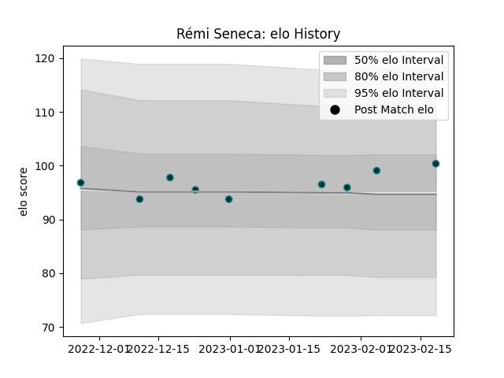

---  
layout: page  
title: Rémi Seneca  
date: 2023-02-24 02:33:21.469717  
categories: player  
---
# Rémi Seneca

## Positions: P

## Current elo: 100.0

## Current Percentile: 60.0

# Elo History

# Match History

| Team   |   Appearances |   Win Rate |
|:-------|--------------:|-----------:|
| Pau    |             9 |   0.388889 |

| Opponent             |   Matches |   Win Rate |
|:---------------------|----------:|-----------:|
| Cheetahs             |         2 |        0   |
| Bayonne              |         1 |        0.5 |
| Brive                |         1 |        1   |
| Dragons              |         1 |        1   |
| Perpignan            |         1 |        0   |
| Racing 92            |         1 |        1   |
| Stade Francais Paris |         1 |        0   |
| Toulon               |         1 |        0   |